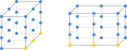

# 线性代数

## 向量点积

$a \cdot b=|a||b|\cos(\theta)=a_xb_x+a_yb_y$

可以理解为先把向量 $a$ 投影到 $b$ 上（带方向），然后再用 $b$ 作为一个缩放因子进行缩放。反过来也可以是把 $b$ 投影到 $a$。

> 更严格地说，点积得到的是内积/对偶配对；当另一个向量是单位向量时，才是通常意义下的正交投影长度。

## 矩阵乘法

设有如下两个矩阵 $A:[m \times n]$、$B:[n \times p]$，当第一个矩阵的列数等于第二个矩阵的行数时，就可以进行乘法运算，结果是一个 $[m \times p]$ 矩阵，计算公式为：

$$
A \times B=
\begin{bmatrix}
a_{11} & \cdots & a_{1n}\\
\vdots  & \ddots & \vdots\\
a_{m1}  & \cdots & a_{mn}
\end{bmatrix}
\times
\begin{bmatrix}
b_{11} &  \cdots & b_{1p}\\
\vdots & \ddots & \vdots\\
b_{n1} &  \cdots & b_{np}
\end{bmatrix}
=
\begin{bmatrix}
\sum_{k=1}^{n}a_{1k}b_{k1}  & \cdots & \sum_{k=1}^{n}a_{1k}b_{kp}\\
\vdots & \ddots & \vdots\\
\sum_{k=1}^{n}a_{mk}b_{k1}  & \cdots & \sum_{k=1}^{n}a_{mk}b_{kp}
\end{bmatrix}
=C
$$

即：

$
c_{ij} = \sum_{k=1}^{n} a_{ik} b_{kj}
= a_{i1}b_{1j} + a_{i2}b_{2j} + \cdots + a_{in}b_{nj}
$

### 矩阵 × 向量

假设现在有一个 $[2 \times 3]$ 矩阵和一个 $[3 \times 1]$ 矩阵，因为第一个矩阵的列数等于第二个矩阵的行数，所以它们能相乘。

$$
\begin{bmatrix}
a_{11} & a_{12} & a_{13}\\
a_{21} & a_{22} & a_{23}
\end{bmatrix}
\times
\begin{bmatrix}
x\\
y\\
z
\end{bmatrix}
=
\begin{bmatrix}
a_{11}x+a_{12}y+a_{13}z\\
a_{21}x+a_{22}y+a_{23}z
\end{bmatrix}
$$

如果我们把左侧矩阵的行当成一个向量，得到

$
a_1=(a_{11},a_{12},a_{13})
$

$
a_2=(a_{21},a_{22},a_{23})
$

把右侧矩阵的列当成一个向量，得到

$
b_1=(x,y,z)
$

不难发现结果矩阵是

$
\begin{bmatrix}
a_1 \cdot b_1 \\
a_2 \cdot b_1
\end{bmatrix}
$

几何角度：

1. 左行作基：把左边矩阵的行向量看作基底（测量轴），右边的列向量往这些行基底上做投影与缩放。矩阵 × 向量，就是把向量投影到新的基底上进行坐标测量（支持非正交、升降维）。
2. 右列作基：反过来，也可以把右边的列向量看作基底，左边矩阵的每一行看作原空间里的向量。因为右边只有一个列向量，所以左边的行向量经过投影缩放后，就直接坍缩成一个个标量。

代数角度：

1. 右边当权重：用右边列向量的元素作权重，对左边矩阵的列向量进行加权求和（线性组合）。
2. 左边当权重：如果以左边矩阵各行的元素作权重，则是对右边的列向量进行加权求和；因为左边有两行（即两组权重），所以会分别算出一组结果，最终叠成两行。

### 矩阵 × 矩阵

以 $[2 \times 3]$ 乘以 $[3 \times 2]$ 为例，本质是把“矩阵 × 向量”推广到了多维。左矩阵按行取，右矩阵按列取，得到一个 $[2 \times 2]$ 的矩阵。

- 几何视角：

    从不同方向观察结果矩阵，会得到两种互补的变换视角：
    - 看列向量：结果矩阵的每一列，代表右边矩阵的每一列在以左边矩阵为基底时的变换结果。
    - 看行向量：结果矩阵的每一行，代表以右边矩阵为基底对左边矩阵的每个行向量进行变换的结果。

- 代数视角（权重与归约）：

    矩阵乘法 $C = A \times B$ 的本质是批量计算加权和：
    - 左行作权重：左边矩阵 $A$ 的第 $i$ 行提供权重系数 $(a_{i1}, a_{i2}, \dots, a_{in})$，去加权右边矩阵 $B$ 的第 $j$ 列数据。
    - 右列作权重：反过来，用右边列的元素作为权重，去加权左边的列向量。

    因为“左列数等于右行数”，两者本质上是高度对称的。这种两两匹配加权（减维归约）的规则，决定了最终结果必定是由 $m$ 行与 $p$ 列组合出的 $[m \times p]$ 矩阵。

因此矩阵乘法有这些性质：

- 顺序不能颠倒：因为运算规则固定为“左边按行、右边按列”，颠倒顺序相当于改变了基底与坐标的配对关系（甚至导致维度无法对齐）。
- 结合律的直觉：矩阵乘法代表**连续的空间变换**。先变换再复合，与将两次变换融合成一个新的“复合基变换”再统一作用，结果完全一致。即：
  $$(A \times B) \times C = A \times (B \times C)$$

## 张量缩并

前面我们学习的矩阵乘法，可以看成两个二阶张量在中间指标上做缩并：

$$C_{ik}=\sum_j A_{ij}B_{jk}$$

把这种“沿配对指标做点积再求和”的操作推广到高维，就是**张量缩并**。

### 三阶张量缩并示例

设现在有一个 $[2\times 3\times 4]$ 和一个 $[3\times 2\times 4]$ 的三维数字容器：

$$A_{xyz},\qquad B_{pqr}$$

其中：

- $A$：$x=2,\ y=3,\ z=4$
- $B$：$p=3,\ q=2,\ r=4$

我们在两个容器中各选一个维度方向，让它们配对缩并。  
比如选 $A$ 的 $y$ 方向和 $B$ 的 $p$ 方向，二者长度都是 3。

固定其他轴后，沿配对轴切出向量：

- 左侧容器固定 $x,z$，沿 $y$ 方向取向量，得到 $n_x \times n_z=2\times 4=8$ 个向量，每个长度 3。
- 右侧容器固定 $q,r$，沿 $p$ 方向取向量，也得到 $n_q \times n_r=2\times 4=8$ 个向量，每个长度 3。

然后对每一对向量做点积：

$$C_{xzqr}=\sum_{y=1}^{3} A_{xyz}B_{yqr}$$

这里 $y$ 被缩并掉，结果保留 $x,z,q,r$ 四个指标，形状为：

$[2,4,2,4]$

是一个四阶张量。

### 张量收缩的特例-矩阵乘法

和二阶张量缩并一样，矩阵乘法中有：

$$
C_{ik}=\sum_j A_{ij}B_{jk}
$$

在结果 $C_{ik}$ 中：

- 下标 $i$ 定位左侧矩阵 $A$ 中参与运算的行向量；
- 下标 $k$ 定位右侧矩阵 $B$ 中参与运算的列向量；
- 下标 $j$ 是被缩并掉的中间指标，不出现在结果里。

高阶张量缩并时同理：结果中保留的自由指标，用来定位原始张量中沿被缩并轴切出的向量或切片；被缩并的指标消失，不再出现在结果中。
张量缩并在几何中表示：把 A 中的向量分别与 B 中的向量做内积，也就是测量 A 中向量在 B 矩阵子空间上的投影分量。

### 张量收缩的一般情况

前面我们考虑的都是只收缩一个轴的情况，如果在两个张量中，有多个轴能匹配（如两个轴），则可以表示为

$$C_{xq}=\sum_{z=1}^Z\sum_{y=1}^Y A_{xyz}B_{yzq}$$

得到的结果是一个二阶张量。在张量缩并中，我们需要同时考虑同收缩轴和保留轴，保留轴决定了结果张量的阶数和收缩轴求和运算被重复执行的次数。

### 爱因斯坦求和约定

因为在张量缩并中，连续的 $\sum$ 符号并不方便书写，所以爱因斯坦求和约定中，
$$C_{ilmn} = A_{ijk l} B_{jk mn}$$
表示同时对重复指标 $j$ 和 $k$ 求和，并且在没有重复指标的情况下，爱因斯坦求和约定还能表示外积，如：
$$C_{ijkl} = A_{ij} B_{kl}$$
在表示外积的时候，我们可以引入一个维度大小为1的虚拟共享轴
$$C_{ij} = \sum_{k=1}^{1} \tilde{A}_{ik} \tilde{B}_{kj} = \tilde{A}_{i1} \tilde{B}_{1j}$$

### 张量收缩中求和运算的几何意义

1. 收缩轴：向量内积得到一个标量，两个同形矩阵点乘求和得到的也是标量，可以理解为带权重的相似度。在张量缩并中，对切片向量做点积，本质上是测量 $A$ 中的向量在 $B$ 子空间上的投影分量与方向一致性。
2. 保留轴：收缩轴是“合并压缩”的维度，而保留轴是“记录观察”的视角。张量缩并就是将复杂高维空间中的向量沿着特定维度进行加权融合与降维抽象的过程。
