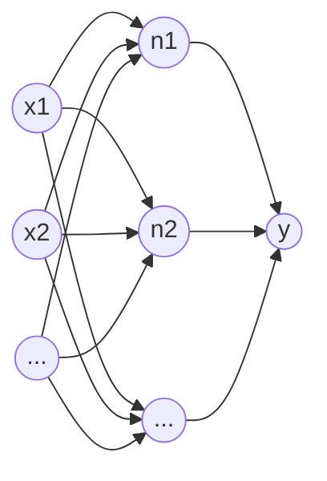

# 神经网络

## 1. 致命的异或（XOR）乌云

我们前面学过的**线性回归**和**逻辑回归**，本质上都是输入直连输出的**“真”一层网络**。在这类模型中，所有的输入特征直接连到最终的输出神经元上。

这种“真”一层模型虽然简单，但在历史上却被一朵巨大的乌云宣判了“死刑”——这就是著名的**异或（XOR）问题**。

在数字电路中，异或的逻辑非常简单：**当两个输入信号相同时，输出为 0；当两个输入信号不同时，输出为 1。** 如果我们把它当成一个机器学习的二分类数据集，它长这样：

| 特征 $x_1$ | 特征 $x_2$ | 真实标签 $y$ (状态) | 几何坐标 |
| :--------: | :--------: | :-----------------: | :------: |
|     0      |     0      |          0          |  $(0,0)$  |
|     0      |     1      |          1          |  $(0,1)$  |
|     1      |     0      |          1          |  $(1,0)$  |
|     1      |     1      |          0          |  $(1,1)$  |

---

为什么经典函数 $y = f(x)$ 分不开 XOR？

如果从最底层的几何与函数定义来审视，XOR 的死局根本不需要扯到复杂的神经网络公式，它完全是被**平面坐标系和经典函数的本质定义**无情碾压的。在数学中，标准函数 $y = f(x)$ 的核心定义就是**单值性**（即一个自变量 $x$ 只能映射到一个唯一的因变量 $y$）。这意味着你拿着一支分类笔从左往右画分类边界，**这支笔可以上下调整，但绝对不能“往回拐”**（不能在同一个 $x$ 轴位置出现重叠、折返或画出一个闭合的圈）。

现在，我们尝试用一条满足 $y = f(x)$ 定义的连续曲线，试图把平面上的假值和真值完全切开。根据分类逻辑，假值必须全在曲线的同一侧（例如下方），真值必须全在曲线的另一侧（例如上方）。

我们盯着 $x = 0$ 和 $x = 1$ 这两个垂直断面：

- **在 $x = 0$ 处**：这里并排立着假值 $(0,0)$ 和真值 $(0,1)$。为了把假值划在下方、真值划在上方，曲线的高度必须卡在它们中间，即：$0 < f(0) < 1$。
- **在 $x = 1$ 处**：这里并排立着真值 $(1,0)$ 和假值 $(1,1)$。为了保持相同的分类标准（假值在下，真值在上），曲线在 $x=1$ 处的高度就必须**同时满足**：
    - 要在假值 $(1,1)$ 的下方 $\to f(1) > 1$
    - 要在真值 $(1,0)$ 的上方 $\to f(1) < 0$

这就诞生了一个绝对不可能成立的悖论：**同一个高度 $f(1)$，怎么可能既大于 1 又小于 0？**
因为这支笔不能在 $x=1$ 的地方搞分身术，它只要不往回拐、不画圈，就只能给出一个唯一的 $y$ 值。

因此，**只要分类边界被死死限制在 $y = f(x)$ 的传统函数框架里，单层模型在原始空间里这一笔直直画过去，顾得了左边，就必然漏掉右边。**

1969年，人工智能先驱马文·明斯基（Marvin Minsky）正式指出了单层感知机根本无法解决 XOR 这样简单的非线性不可分问题，直接将神经网络打入冷宫数十年，历史称之为神经网络的“第一次寒冬”。

---

## 2. 多层神经网络（MLP）的引入

为了打破经典函数在原始空间里的魔咒，让分类边界能够玩出“往回拐、圈包、甚至空间重塑”的魔术，必须引入**“隐藏层（Hidden Layer）”**。

下面是一个标准的、包含一个隐藏层的神经网络示意图：

