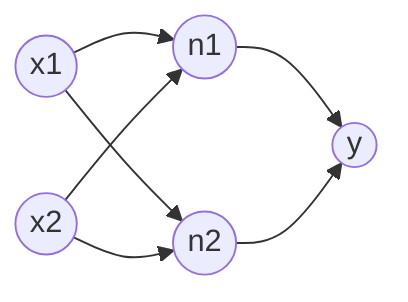
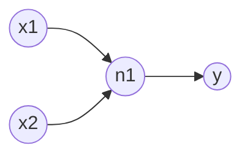

# 多层函数的几何学：空间的切割与弯曲

## 单层模型的局限性

我们前面学过的**线性回归**和**逻辑回归**，本质上都是输入直连输出的**“单节点”模型**。在这类模型中，所有的输入特征直接连接到最终的输出节点上。

这种单节点模型虽然简单，却有着非常致命的几何缺陷。考虑这样一个有两个输入的模型：
$$\mathrm{out}=\sigma(\omega_1 x+\omega_2 y+b)$$

无论我们的激活函数 $\sigma$ 设计得多么巧妙，令内部的线性部分为 $L=\omega_1 x+\omega_2 y+b$，这个线性函数的梯度方向始终为固定向量 $\overrightarrow{(\omega_1,\omega_2)}$。

如果我们沿着垂直于该梯度的方向移动， $L$ 的变化量永远为 $0$。这也就意味着，单节点模型在空间中**永远无法拟合出一个独立的山峰或山谷**——因为总存在一个方向没有任何起伏，只能无限延伸。

在数学上，形如 $\mathrm{out}=f(\omega_1 x_1+\dots+\omega_n x_n+b)$ 的函数被称为**脊函数（Ridge Function）**。它的所有梯度方向都是平行的，只能在一个方向上弯曲。

<BiFunctionEcharts :exprs="[{u:{min:-10,max:10,step:1},v:{min:-10,max:10,step:1},x:'u',y:'v',z:'1/(1+e^(-(u)))'}]" title="脊函数"/>

如上图所示，二元脊函数 $f(x,y)=\frac{1}{1+e^{-x}}$ 就像一片弯曲的钢板，在另一个维度上没有任何波澜，只有单一方向的弯曲自由度。

---

## 引入隐藏节点：打破“脊”的魔咒

为了打破脊函数在原始空间里的魔咒，让决策边界能够玩出“往回拐、圆环包围、甚至空间重塑”的魔术，我们必须引入**“隐藏节点（Hidden Node）”**。

通过在输入与输出之间额外添加一层中间节点，我们就能轻松解决山脊问题：

在上图中，系统的最终输出表达式为：
$$y=\sigma\Big(w_1 \cdot \sigma(v_{11}x_1+v_{12}x_2+b_1) + w_2 \cdot \sigma(v_{21}x_1+v_{22}x_2+b_2) + b_3\Big)$$

由于内部两个线性函数的系数方向不同，它们的线性组合不再是单一方向的脊函数！

但注意：**仅仅增加节点数量是不够的，节点的连接结构同样关键**。如果我们按照下面这种结构搭建：

得到输出函数为：
$$\mathrm{out} = \sigma_2\Big(w_1 \cdot \sigma_1(v_1x + v_2y + b_1) + b_2\Big)$$

这依然是一个脊函数！因为内部只有一个线性映射，垂直于 $\overrightarrow{(v_1, v_2)}$ 的方向上依然是一条无波澜的“死线”，在空间中依然像一座无限延伸的大坝，无法合围出独立的区域。

**直觉总结**：每个前级节点就像在用一块“脊函数钢板”切割空间，而后续节点则是将这些切割结果进行加权组合，最终在空间中合围出你想要的封闭山峰与山谷。

---

## 宽度的拓展与深度的魔法

理论上，只要我们在中间层加入**足够多**的并行节点（增加宽度），就可以组合出任意复杂的空间形状，拟合任何连续函数。

但如果只有宽度而没有深度，模型就像是在玩一场极其低效的“像素拼图”。为了拼出一辆复杂的汽车，它必须用数以亿计的不同方向的平直“钢板”去死磕每一个曲线轮廓。数学上已经证明，某些复杂函数如果只用单层中间节点拟合，所需的节点数量是指数级（$2^n$）的，这会瞬间撑爆计算机内存。

而**增加层数（深度）**，为系统带来了颠覆性的几何魔法：

1. **分级抽象与解构**：深层结构不再是一步登天，而是“由浅入深”地做特征组合。前一层先切割出大致轮廓，后一层在这个基础上进行二次弯曲和组合。
2. **指数级效率提升**：后层节点不仅能复用前层的切割成果，还可以从另一个维度将其“掰弯”。只需少量的节点按多层叠加，就能锻打出极其复杂的非线性曲面。

这就是为什么复杂的几何拟合不仅需要“变宽”，更需要“变深”。

---

## 瓶颈与思考：当复合函数变成巨型迷宫

虽然叠加节点的宽度与深度能带来毁天灭地的拟合能力，但这也带来了一个致命的工程难题：

假设我们构建了一个包含几十个节点、四五层深度的复杂系统，最终展开的数学公式将是一个嵌套了几十层的**超级巨型复合函数**。

面对这样一个庞然大物：

- 我们不可能再像前几章那样，用人工纸笔去逐个推导每个参数的偏导数公式。
- 节点之间的连接交错复杂，一个参数的变化会引发后面所有节点连锁反应式的波动。

**我们该如何让计算机自动、高效地算出每一个参数的梯度？**

下一章，我们将彻底脱离具体的网络结构，引入现代人工智能基石级的工具——**计算图（Computation Graph）与反向传播（Backpropagation）**，看看如何用“剥洋葱”的算法，优雅地破解任意复杂系统的求导难题！
