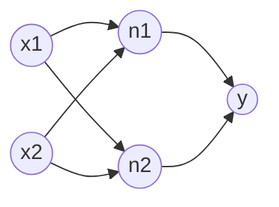
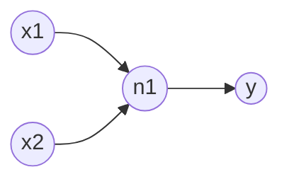

# 神经网络初窥

##  单层网络的局限性

我们前面学过的**线性回归**和**逻辑回归**，本质上都是输入直连输出的**“真”一层网络**。在这类模型中，所有的输入特征直接连到最终的输出神经元上。

这种“真”一层模型虽然简单，但是却有非常严重的缺陷，考虑到这样一个有两个输入的模型：
$$\mathrm{out}=\sigma(\omega_1 x+\omega_2 y+b)$$

不管我们的激活函数 $\sigma$ 设计的多巧妙，如果我们在 $(x_0,y_1)$ 处，往垂直于  $\overrightarrow{(\omega_1,\omega_2)}$ 方向移动，因为设 $L=\omega_1 x+\omega_2 y+b$，这个向量就是激活函数里面嵌套的这个线性函数的梯度，我们垂直移动，L的变化量是0。这也就意味着我们无法用上面的函数拟合出一个山峰，因为总有一个方向不是下坡，而是在水平移动，同样的也无法拟合山谷。

形如 $\mathrm{out}=f(\omega_1 x_1+\dots+\omega_n x_n+b)+g(\omega_1 x_1+\dots+\omega_n x_n+b)$ 的函数也叫做脊函数，这里面各个内部线性函数的权重方向（或梯度方向）一致。

##  多层神经网络（MLP）的引入

为了打破经典函数在原始空间里的魔咒，让分类边界能够玩出“往回拐、圈包、甚至空间重塑”的魔术，必须引入**“隐藏层（Hidden Layer）”**。

通过额外添加的一层神经元，我们就能处理掉令人头疼的山脊问题

可以看到图中的是这样的输出 $y=\sigma\Big(w_1 \cdot \sigma(v_{11}x_1+v_{12}x_2+b_1) + w_2 \cdot \sigma(v_{21}x_1+v_{22}x_2+b_2) + b_3\Big)$，因为每个内部线性函数原始变量的系数不同，所以这个函数已经不是脊函数了。但是如果我们按照下面这种方式构建网络，仍然是不可行的

得到这样一个函数 $\mathrm{out} = \sigma_2\Big(w_1 \cdot \sigma_1(v_1x + v_2y + b_1) + b_2\Big)$ 这还是脊函数哦，因为每个内部线性函数（就只有一个线性函数）原始变量的系数还是一样的。

这也就意味着，如果我们在空间中沿着垂直于 $\overrightarrow{(v_1, v_2)}$ 的方向移动，内部骨架的值不会变，经过第一层激活函数后不会变，传到最外层输出依然是一条毫无波澜的“死线”。它在垂直方向上依然是一座无限平移延伸的大坝，同样无法在空间中合围出独立的山峰和山谷。

每一个神经元就像在用一个脊函数切割空间，而下一层的神经元则是把这些切割合并，在空间中切出你想要的山峰和山谷。

<BiFunctionEcharts :exprs="[{u:{min:-10,max:10,step:1},v:{min:-10,max:10,step:1},x:'u',y:'v',z:'1/(1+e^(-(u)))'}]" title="脊函数"/>

这是一个脊函数 $f(x,y)=\frac{1}{1+e^{-(x)}}$ （可以内部理解成 $z=1 \times x+0 \times y+0$）的示例图，可以看到二元函数的脊函数形式就像一片弯曲的钢板，只能有一个方向的弯曲自由度。

## 深度

理论上我们用只有一个隐藏层（输入和输出之外的神经元），就可以拟合任意函数了，无非就是把这一层的神经元数量（宽度）加多而已。但是随着目标函数变得复杂，需要的神经元数量将会爆炸。

如果网络只有宽度没有深度，网络就像是在玩一场极其低效的“像素拼图”。为了拼出一辆复杂的汽车，它必须在唯一的隐藏层里，用数以亿计的不同方向的“微小脊函数钢板”去死磕每一个线条和轮廓。数学上已经证明，某些复杂函数如果只用单隐藏层拟合，所需的神经元数量是指数级（$2^n$）的，这会瞬间撑爆计算机的内存。

而深度的引入，为神经网络带来了两个颠覆性的魔法：

1. 概念的层级组合（解构复杂世界）
    深层网络不再是一步登天，而是“由浅入深”地做特征组合：
    - 前一层先用少量“钢板”切分出大致形状
    - 后一层不仅可以直接复用前一层的钢板，而且可以给这块“钢板”新增一个弯曲自由度（可以从另外一个方向掰弯）

增加深度带来的效率提升也是指数级提升的，只需少量的“钢板”（神经元），从不同方向锻打弯曲得到复杂的曲面。这就是为什么现代人工智能不仅需要变宽，更需“变深”的几何真相。