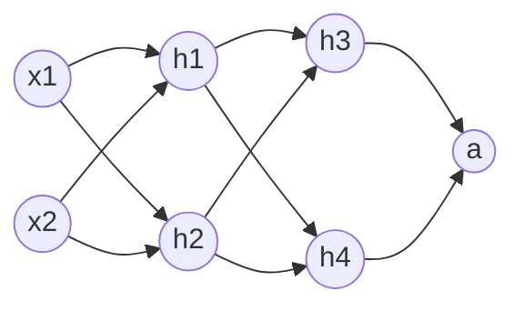
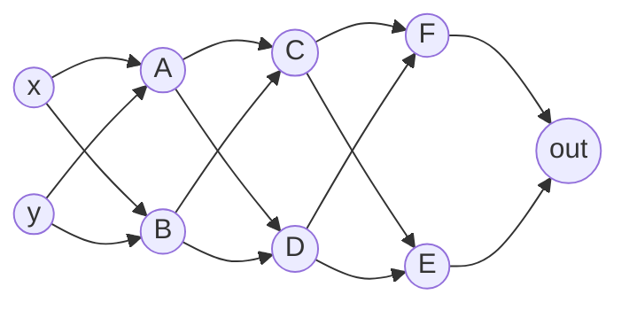

# 计算图

在前面解决“电压校准”时，我们处理的是单层线性映射。但面对复杂的非线性问题时，单一的线性公式显然力不从心。

为了构建更强大的拟合能力，我们需要将多个简单算子叠加在一起。在动手写复杂代码之前，我们先退后一步：**把整个计算过程看作一张由节点和连线构成的“计算图（Computation Graph）”**。

只要每一个节点内部的运算都是可导的，无论图的结构多么自由、节点的运算公式多么奇特，我们都能用同一种优雅的机制——**反向传播（Backpropagation）**，自动求出每个参数的梯度。

## 计算图的前向传播

假设我们构建了一个如下结构的计算图。输入信号通过节点一步步向前流动，最终输出结果并计算损失：

我们为图中的每个节点赋予独立的参数（这里以常见的线性加权叠加为例）：

| 节点    | 节点内部参数              |
| :------ | :------------------------ |
| $h_{1}$ | $\set{ω_{11},ω_{12},b_1}$ |
| $h_{2}$ | $\set{ω_{21},ω_{22},b_2}$ |
| $h_{3}$ | $\set{ω_{31},ω_{32},b_3}$ |
| $h_{4}$ | $\set{ω_{41},ω_{42},b_4}$ |
| $a$     | $\set{ω_{a1},ω_{a2},b_a}$ |

如果把整张图展开成一个单一函数，加上损失函数 $\operatorname{Loss}$ 之后，会得到这样一个眼花缭乱的复合函数：
$$L=\operatorname{Loss}(\sigma(ω_{a1}(\sigma(ω_{31}(\sigma(ω_{11}x_1+ω_{12}x_2+b_1))+ω_{32}(\sigma(ω_{21}x_1+ω_{22}x_2+b_2))+b_3))+ω_{a2}(\sigma(ω_{41}(\sigma(ω_{11}x_1+ω_{12}x_2+b_1))+ω_{42}(\sigma(ω_{21}x_1+ω_{22}x_2+b_2))+b_4))+b_a))$$

面对这个巨型函数，我们不需要一次性求出全部表达式。我们可以把每一步运算拆开，按节点按顺序计算，这就是**前向传播**：

$z_1=ω_{11}x_1+ω_{12}x_2+b_1$  
$z_2=ω_{21}x_1+ω_{22}x_2+b_2$  
$h_1=σ_1(z_1)$  
$h_2=σ_2(z_2)$  
$z_3=ω_{31}h_1+ω_{32}h_2+b_3$  
$z_4=ω_{41}h_1+ω_{42}h_2+b_4$  
$h_3=σ_3(z_3)$  
$h_4=σ_4(z_4)$  
$z_a=ω_{a1}h_3+ω_{a2}h_4+b_a$  
$a=σ(z_a)$  
$\operatorname{Loss}(a)$

在实际计算时，我们分步计算每个节点的中间输出，并把中间结果缓存下来，作为下游节点的输入。

## 敏感度与反向传播

在使用梯度下降训练系统时，我们需要求出损失函数对所有参数的偏导数 $\set{\dfrac{\partial L}{\partial ω_{11}},\dfrac{\partial L}{\partial ω_{12}},\dots,\dfrac{\partial L}{\partial b_1},\dots}$。

利用多元复合函数的链式法则，我们可以用**“剥洋葱”**的方法，从输出节点开始，一步步逆向倒推每个参数的偏导数。

### 剥开最外层：输出节点 $a$ 的参数偏导数

$ΔL=\dfrac{\partial L}{\partial a}Δa$  
$Δa=\dfrac{\partial a}{\partial z_a}Δz_a$  
$Δz_a=\dfrac{\partial z_a}{\partial ω_{a1}}Δω_{a1}+\dfrac{\partial z_a}{\partial ω_{a2}}Δω_{a2}+\dfrac{\partial z_a}{\partial b_a}Δb_a$

在计算 $\dfrac{\partial L}{\partial ω_{a1}}$ 时，由于 $ω_{a2}$ 和 $b_a$ 是独立变量，我们可以暂且不管它们，最终得到：

$\dfrac{\partial L}{\partial ω_{a1}}=\dfrac{\partial L}{\partial a}\dfrac{\partial a}{\partial z_a}\dfrac{\partial z_a}{\partial ω_{a1}}=\dfrac{\partial L}{\partial a}\dfrac{\partial a}{\partial z_a}h_3$

$\dfrac{\partial L}{\partial ω_{a2}}=\dfrac{\partial L}{\partial a}\dfrac{\partial a}{\partial z_a}\dfrac{\partial z_a}{\partial ω_{a2}}=\dfrac{\partial L}{\partial a}\dfrac{\partial a}{\partial z_a}h_4$

$\dfrac{\partial L}{\partial b_a}=\dfrac{\partial L}{\partial a}\dfrac{\partial a}{\partial z_a}\dfrac{\partial z_a}{\partial b_a}=\dfrac{\partial L}{\partial a}\dfrac{\partial a}{\partial z_a}$

### 深入中间层：节点 $h_3$ 的参数偏导数

接下来往前倒推一步，以节点 $h_3$ 为例，目标是求 $ω_{31}$、$ω_{32}$、$b_3$ 的偏导：

$ΔL=\dfrac{\partial L}{\partial a}Δa$  
$Δa=\dfrac{\partial a }{\partial z_a}Δz_a$  
$Δz_a=\dfrac{\partial z_a}{\partial h_3}Δh_3+\dfrac{\partial z_a}{\partial h_4}Δh_4+\dfrac{\partial z_a}{\partial b_a}Δb_a$  
（_注_：由于 $h_4$ 和 $b_a$ 与 $h_3$ 内部的参数完全独立，计算 $h_3$ 的参数偏导时 $Δh_4 \equiv 0, Δb_a \equiv 0$）

$Δh_3=\dfrac{\partial h_3}{\partial z_3}Δz_3$  
$Δz_3=\dfrac{\partial z_3}{\partial ω_{31}}Δω_{31}+\dfrac{\partial z_3}{\partial ω_{32}}Δω_{32}+\dfrac{\partial z_3}{\partial b_3}Δb_3$

展开后得到：

$\dfrac{\partial L}{\partial ω_{31}}=\dfrac{\partial L}{\partial a}\dfrac{\partial a }{\partial z_a}\dfrac{\partial z_a}{\partial h_3}\dfrac{\partial h_3}{\partial z_3}\dfrac{\partial z_3}{\partial ω_{31}}=\dfrac{\partial L}{\partial a}\dfrac{\partial a }{\partial z_a}\dfrac{\partial z_a}{\partial h_3}\dfrac{\partial h_3}{\partial z_3}h_1$

$\dfrac{\partial L}{\partial ω_{32}}=\dfrac{\partial L}{\partial a}\dfrac{\partial a }{\partial z_a}\dfrac{\partial z_a}{\partial h_3}\dfrac{\partial h_3}{\partial z_3}\dfrac{\partial z_3}{\partial ω_{32}}=\dfrac{\partial L}{\partial a}\dfrac{\partial a }{\partial z_a}\dfrac{\partial z_a}{\partial h_3}\dfrac{\partial h_3}{\partial z_3}h_2$

$\dfrac{\partial L}{\partial b_3}=\dfrac{\partial L}{\partial a}\dfrac{\partial a }{\partial z_a}\dfrac{\partial z_a}{\partial h_3}\dfrac{\partial h_3}{\partial z_3}\dfrac{\partial z_3}{\partial b_3}=\dfrac{\partial L}{\partial a}\dfrac{\partial a }{\partial z_a}\dfrac{\partial z_a}{\partial h_3}\dfrac{\partial h_3}{\partial z_3}$

### 继续倒推：节点 $h_1$ 的参数偏导数

现在计算更靠前节点 $h_1$ 的参数偏导（目标：$ω_{11}$、$ω_{12}$、$b_1$）。因为 $h_1$ 的输出同时连向了下游的 $h_3$ 和 $h_4$，所以它的波动会沿着两条路径共同影响最终损失：

$Δz_3=\dfrac{\partial z_3}{\partial h_1}Δh_1 + \dots$  
$Δz_4=\dfrac{\partial z_4}{\partial h_1}Δh_1 + \dots$

经过路径汇集整理后：

$\dfrac{\partial L}{\partial ω_{11}}=\dfrac{\partial L}{\partial a}\dfrac{\partial a}{\partial z_a}\left(\dfrac{\partial z_a}{\partial h_3}\dfrac{\partial h_3}{\partial z_3}\dfrac{\partial z_3}{\partial h_1}+\dfrac{\partial z_a}{\partial h_4}\dfrac{\partial h_4}{\partial z_4}\dfrac{\partial z_4}{\partial h_1}\right)\dfrac{\partial h_1}{\partial z_1}\dfrac{\partial z_1}{\partial ω_{11}}$

$\dfrac{\partial L}{\partial ω_{12}}=\dfrac{\partial L}{\partial a}\dfrac{\partial a}{\partial z_a}\left(\dfrac{\partial z_a}{\partial h_3}\dfrac{\partial h_3}{\partial z_3}\dfrac{\partial z_3}{\partial h_1}+\dfrac{\partial z_a}{\partial h_4}\dfrac{\partial h_4}{\partial z_4}\dfrac{\partial z_4}{\partial h_1}\right)\dfrac{\partial h_1}{\partial z_1}\dfrac{\partial z_1}{\partial ω_{12}}$

$\dfrac{\partial L}{\partial b_1}=\dfrac{\partial L}{\partial a}\dfrac{\partial a}{\partial z_a}\left(\dfrac{\partial z_a}{\partial h_3}\dfrac{\partial h_3}{\partial z_3}\dfrac{\partial z_3}{\partial h_1}+\dfrac{\partial z_a}{\partial h_4}\dfrac{\partial h_4}{\partial z_4}\dfrac{\partial z_4}{\partial h_1}\right)\dfrac{\partial h_1}{\partial z_1}\dfrac{\partial z_1}{\partial b_1}$

## 偏导数的通用规律总结

对比上面的结果，我们把前缀公式提取出来：

输出节点：  
$\dfrac{\partial L}{\partial ω_{a1}}=\left[\mathbf{\dfrac{\partial L}{\partial a}\dfrac{\partial a}{\partial z_a}}\right] h_3$

节点 $h_3$：  
$\dfrac{\partial L}{\partial ω_{31}}=\left[\mathbf{\dfrac{\partial L}{\partial a}\dfrac{\partial a }{\partial z_a}\dfrac{\partial z_a}{\partial h_3}\dfrac{\partial h_3}{\partial z_3}}\right] h_1$

节点 $h_1$：  
$\dfrac{\partial L}{\partial ω_{11}}=\left[\mathbf{\dfrac{\partial L}{\partial a}\dfrac{\partial a}{\partial z_a}\left(\dfrac{\partial z_a}{\partial h_3}\dfrac{\partial h_3}{\partial z_3}\dfrac{\partial z_3}{\partial h_1}+\dfrac{\partial z_a}{\partial h_4}\dfrac{\partial h_4}{\partial z_4}\dfrac{\partial z_4}{\partial h_1}\right)\dfrac{\partial h_1}{\partial z_1}}\right] x_1$

仔细观察方括号内部分，你会发现：**求任何参数的偏导时，前面的项都代表了“损失函数对当前节点激活前内部状态的偏导数”**。

我们把这个关键的中间结果定义为节点的**敏感度（Sensitivity，常用 $\delta$ 表示）**：

$δ_a=\dfrac{\partial L}{\partial a}\dfrac{\partial a}{\partial z_a}=\dfrac{\partial L}{\partial z_a}$

$δ_3=δ_a\dfrac{\partial z_a}{\partial h_3}\dfrac{\partial h_3}{\partial z_3}=\dfrac{\partial L}{\partial z_3}$

$δ_4=δ_a\dfrac{\partial z_a}{\partial h_4}\dfrac{\partial h_4}{\partial z_4}=\dfrac{\partial L}{\partial z_4}$

$δ_1 = \left(\delta_3 \dfrac{\partial z_3}{\partial h_1} + \delta_4 \dfrac{\partial z_4}{\partial h_1}\right)\dfrac{\partial h_1}{\partial z_1} = \dfrac{\partial L}{\partial z_1}$

有了**敏感度 $\delta$**，所有参数的偏导计算瞬间变得清爽无比：

$$\dfrac{\partial L}{\partial ω_{a1}} = \delta_a h_3$$
$$\dfrac{\partial L}{\partial ω_{31}} = \delta_3 h_1$$
$$\dfrac{\partial L}{\partial ω_{11}} = \delta_1 x_1$$

这就是 **反向传播（Backpropagation）** 的精髓，我们从后往前传递敏感度 $\delta$，后方节点计算完毕后，前方节点直接复用结果，避免了海量的重复计算。

## 偏导数自动化求解流程

总结一下，对计算图中的任意节点 $h$，求解参数梯度的通式为：

1. **计算自身敏感度 $\delta$**（假定所有由 $h$ 直接连向的下游节点 $i$ 的敏感度 $\delta_i$ 已经计算完毕）：
   $$\delta =\dfrac{\partial L}{\partial z}=\left(\sum _{i}\delta _{i}\dfrac{\partial z_{i}}{\partial h}\right)\dfrac{\partial h}{\partial z}$$

    > 1. $\delta_i$ 是下游直连节点的敏感度，$\dfrac{\partial z_{i}}{\partial h}$ 是下游节点 $i$ 激活前的内部状态 $z_i$ 对当前节点输出 $h$ 的偏导，$\dfrac{\partial h}{\partial z}$ 是自身激活函数的导数。
    > 2. 输出节点也是计算节点，只是没有下游节点，因此上面的求和公式对它不适用，需要直接用定义$\delta =\dfrac{\partial L}{\partial z}$ 计算敏感度。

2. **计算自身参数的偏导数**：
   $$\dfrac{\partial L}{\partial ω}=δ\dfrac{\partial z}{\partial ω}$$
    > $\dfrac{\partial z}{\partial ω}$ 是节点内部函数对参数的偏导数。

只要计算图是一个有向无环图（DAG），依靠这个通用流程，无论各个图元连接多么复杂，无论节点内部采用什么计算公式，我们都能顺藤摸瓜求出每一个参数的梯度。

## 交互式演示

把上面这套机制放进一个**可直接运行的交互组件**：用「邻接矩阵自动构造 + 前向传播 → 反向传播 → 梯度下降」，训练一个多层计算图，学会判断平面上的点 $(x, y)$ 属于「圆内」还是「圆外」（以 $r_1$、$r_2$ 为内外半径，两者之间是带概率标注的模糊带）。

下面是一个宽度 $2$、深度 $3$ 的 `dense(2, 3)` 网络（输入 $2$ 节点 → 隐藏 $3$ 层（每层 $2$ 节点）→ 输出 $1$ 节点，共 $9$ 个节点）的示意结构——图中展示的是节点之间的**连接拓扑**；每个节点内部实际执行 $z=\sum_i \omega_i h_i + b$，使用了 $\operatorname{sigmoid}$ 作为激活函数，使用交叉熵损失作为损失函数：

- **任务数据**：按圆内 / 模糊带 / 圆外分层采样各约 1/3，避免圆内面积太小导致监督样本过少；
- **参数区**：可调整网络宽度/深度、样本数、学习率、训练轮数、内外半径（默认 `dense(8, 2)`、800 样本、300 轮、lr 0.3）；
- **运行**：训练放在Web Worker 后台线程执行，界面不会卡顿；实时打印每个阶段的平均损失（该轮全部样本交叉熵的平均值）；
- **结果**：训练结束后给出测试集准确率，并绘制一张“预测圆外概率”热力图（蓝：圆内，红：判为圆外），白色虚线圆环标示真实的 $r_1 / r_2$ 边界；
- **注意**：每次运行都会重新随机初始化网络参数并重新生成训练数据，因此结果存在波动，属正常现象。

> 可以试着调大隐藏层宽度、调小学习率或者增加学习样本数量，观察平均损失下降的平滑度、以及热力图中边界清晰度的变化。

<GraphDemo />
