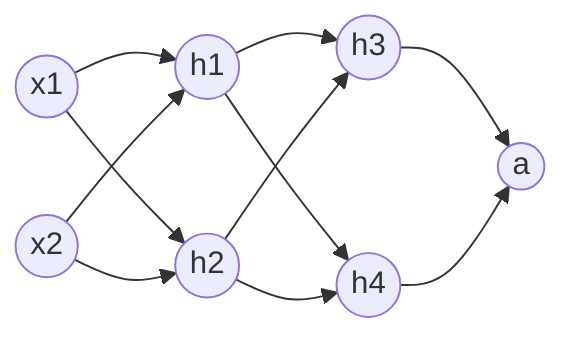

# 多层感知机

通过上一章的内容，我们已经了解到多层神经网络的威力，如果有这样一个网络：

设每个神经元参数如下：

| 神经元  | 参数                      |
| ------- | ------------------------- |
| $h_{1}$ | $\set{ω_{11},ω_{12},b_1}$ |
| $h_{2}$ | $\set{ω_{21},ω_{22},b_2}$ |
| $h_{3}$ | $\set{ω_{31},ω_{32},b_3}$ |
| $h_{4}$ | $\set{ω_{41},ω_{42},b_4}$ |
| $a$     | $\set{ω_{a1},ω_{a2},b_a}$ |

如果加上损失函数 $\operatorname{Loss}$ 之后，最终得到这样一个眼花缭乱的函数：
$$L=\operatorname{Loss}(\sigma(ω_{a1}(\sigma(ω_{31}(\sigma(ω_{11}x_1+ω_{12}x_2+b_1))+ω_{32}(\sigma(ω_{21}x_1+ω_{22}x_2+b_2))+b_3))+ω_{a2}(\sigma(ω_{41}(\sigma(ω_{11}x_1+ω_{12}x_2+b_1))+ω_{42}(\sigma(ω_{21}x_1+ω_{22}x_2+b_2))+b_4))+b_a))$$

## 前向传播

虽然前面这个最终函数看起来巨复杂，但是我们可以把每一步的结果拆分开，便于人类阅读，同时也为后续用矩阵存储参数埋下伏笔。我们上面这个函数实际上是这样一层一层算出来的：

$z_1=ω_{11}x_1+ω_{12}x_2+b_1$
$z_2=ω_{21}x_1+ω_{22}x_2+b_2$
$h_1=σ_1(z_1)$
$h_2=σ_2(z_2)$
$z_3=ω_{31}h_1+ω_{32}h_2+b_3$
$z_4=ω_{41}h_1+ω_{42}h_2+b_4$
$h_3=σ_3(z_3)$
$h_4=σ_4(z_4)$
$z_a=ω_{a1}h_3+ω_{a2}h_4+b_a$
$a=σ(z_a)$
$\operatorname{Loss}(a)$

在实际计算的时候，我们可以分层计算结果，然后把结果作为下一层的输入继续计算，这个动作就是**前向传播**

## 反向传播

在使用梯度下降训练模型的时候，我们需要计算 $\set{\dfrac{\partial L}{\partial ω_{11}},\dfrac{\partial L}{\partial ω_{12}},\dots,\dfrac{\partial L}{\partial b_1},\dfrac{\partial L}{\partial b_2},\dots}$ 这一大堆。还记得我们在数学部分提到的[多元复合函数的导数](/01-Math/AdvancedMathematics#多元复合函数的导数)吗，我们的“剥洋葱”法可以轻松的计算出每个参数的偏导数。

### 开胃菜：计算输出神经元a的参数偏导数：

$ΔL=\dfrac{\partial L}{\partial a}Δa$
$Δa=\dfrac{\partial a}{\partial z_a}Δz_a$
$Δz_a=\dfrac{\partial z_a}{\partial ω_{a1}}Δω_{a1}+\dfrac{\partial z_a}{\partial ω_{a2}}Δω_{a2}+\dfrac{\partial z_a}{\partial b_a}Δb_a$ （$z_a$ 是一个三元函数）

到这里，可以把 $ω_{a1}$ 理解成这样一个函数 $ω_{a1}=ω_{a1}$，$ω_{a1}$ 和另外两个函数 $ω_{a2}$、$b_a$ 完全没关系

所以在计算 $\dfrac{\partial L}{\partial ω_{a1}}$ 时，在z这个三元函数拆分现场，我们是可以不管 $ω_{a2}$ 和 $b_a$ 的，同理对 $\dfrac{\partial L}{\partial ω_{a2}}$ 和 $\dfrac{\partial L}{\partial b_a}$ 也是一样的处理策略，最后得到：

$\dfrac{\partial L}{\partial ω_{a1}}=\dfrac{\partial L}{\partial a}\dfrac{\partial a}{\partial z_a}\dfrac{\partial z_a}{\partial ω_{a1}}=\dfrac{\partial L}{\partial a}\dfrac{\partial a}{\partial z_a}h_3$

$\dfrac{\partial L}{\partial ω_{a2}}=\dfrac{\partial L}{\partial a}\dfrac{\partial a}{\partial z_a}\dfrac{\partial z_a}{\partial ω_{a2}}=\dfrac{\partial L}{\partial a}\dfrac{\partial a}{\partial z_a}h_4$

$\dfrac{\partial L}{\partial b_a}=\dfrac{\partial L}{\partial a}\dfrac{\partial a}{\partial z_a}\dfrac{\partial z_a}{\partial b_a}=\dfrac{\partial L}{\partial a}\dfrac{\partial a}{\partial z_a}$

### 难度增加：计算倒数第一层神经元的参数偏导数

同一层神经元参数的偏导数计算方法是一样的（神经元的函数结构一致，而且同一层神经元没有连接，意味着他们之间没有任何相互影响），所以我们挑 $h_3$ 来做个演示，目标是 $ω_{31}$、$ω_{32}$、$b_3$：

$ΔL=\dfrac{\partial L}{\partial a}Δa$
$Δa=\dfrac{\partial a }{\partial z_a}Δz_a$
$Δz_a=\dfrac{\partial z_a}{\partial h_3}Δh_3+\dfrac{\partial z_a}{\partial h_4}Δh_4+\dfrac{\partial z_a}{\partial b_a}Δb_a$ （_敲黑板_：这时候变量变成了 $h_3$ 而不是 $ω_{a1}$ 了，从数学上来说这个写法和前面写法是等价的，只是为了方便我们继续计算而已，并且因为 $Δb$ 完全不受 $ω_{31}$、$ω_{32}$、$b_3$ 的影响，所以我们在计算上述三个变量偏导数时都不需要考虑 $Δb$ 了，这时候 $Δb\equiv0$，同样的因为 $h_3$ 的几个参数和 $h_4$ 没有任何关系，所以我们也不需要考虑 $Δh_4$ 了，这时候 $Δh_4 \equiv 0$）
$Δh_3=\dfrac{\partial h_3}{\partial z_3}Δz_3$
$Δz_3=\dfrac{\partial z_3}{\partial ω_{31}}Δω_{31}+\dfrac{\partial z_3}{\partial ω_{32}}Δω_{32}+\dfrac{\partial z_3}{\partial b_3}Δb_3$
所以有：
$\dfrac{\partial L}{\partial ω_{31}}=\dfrac{\partial L}{\partial a}\dfrac{\partial a }{\partial z_a}\dfrac{\partial z_a}{\partial h_3}\dfrac{\partial h_3}{\partial z_3}\dfrac{\partial z_3}{\partial ω_{31}}=\dfrac{\partial L}{\partial a}\dfrac{\partial a }{\partial z_a}\dfrac{\partial z_a}{\partial h_3}\dfrac{\partial h_3}{\partial z_3}h_1$

$\dfrac{\partial L}{\partial ω_{32}}=\dfrac{\partial L}{\partial a}\dfrac{\partial a }{\partial z_a}\dfrac{\partial z_a}{\partial h_3}\dfrac{\partial h_3}{\partial z_3}\dfrac{\partial z_3}{\partial ω_{32}}=\dfrac{\partial L}{\partial a}\dfrac{\partial a }{\partial z_a}\dfrac{\partial z_a}{\partial h_3}\dfrac{\partial h_3}{\partial z_3}h_2$

$\dfrac{\partial L}{\partial b_3}=\dfrac{\partial L}{\partial a}\dfrac{\partial a }{\partial z_a}\dfrac{\partial z_a}{\partial h_3}\dfrac{\partial h_3}{\partial z_3}\dfrac{\partial z_3}{\partial b_3}=\dfrac{\partial L}{\partial a}\dfrac{\partial a }{\partial z_a}\dfrac{\partial z_a}{\partial h_3}\dfrac{\partial h_3}{\partial z_3}$

这时候可能还没发现什么特别强的规律，接下来我们上最后一击

### 终极计算：计算倒数第二层神经元的参数偏导数

### 终极计算：计算倒数第二层神经元的参数偏导数

现在我们试一下计算 $h_1$ 的参数，目标是 $ω_{11}$、$ω_{12}$、$b_1$

$ΔL=\dfrac{\partial L}{\partial a}Δa$
$Δa=\dfrac{\partial a }{\partial z_a}Δz_a$
$Δz_a=\dfrac{\partial z_a}{\partial h_3}Δh_3+\dfrac{\partial z_a}{\partial h_4}Δh_4+\dfrac{\partial z_a}{\partial b_a}Δb_a$ （$b_a$ 和 $h_3$、$h_4$ 无关联，所以 $ω_{11}$、$ω_{12}$、$b_1$ 怎么变化 $Δb_a \equiv 0$）
$Δh_3=\dfrac{\partial h_3}{\partial z_3}Δz_3$
$Δh_4=\dfrac{\partial h_4}{\partial z_4}Δz_4$
$Δz_3=\dfrac{\partial z_3}{\partial h_1}Δh_1+\dfrac{\partial z_3}{\partial h_2}Δh_2+\dfrac{\partial z_3}{\partial b_3}Δb_3$ （这里 $z_3$ 写法和上面又有一些变化了，但是等价的。因为 $h_2$ 和 $b_3$ 与 $h_1$ 完全独立，所以在计算 $h_1$ 参数的偏导数时，他们也等于0）
$Δz_4=\dfrac{\partial z_4}{\partial h_1}Δh_1+\dfrac{\partial z_4}{\partial h_2}Δh_2+\dfrac{\partial z_4}{\partial b_4}Δb_4$（同样 $h_2$ 和 $b_4$ 与 $h_1$ 完全独立，所以在计算 $h_1$ 参数的偏导数时，他们也等于0）
$Δh_1=\dfrac{\partial h_1}{\partial z_1}Δz_1$
$Δz_1=\dfrac{\partial z_1}{\partial ω_{11}}Δω_{11}+\dfrac{\partial z_1}{\partial ω_{12}}Δω_{12}+\dfrac{\partial z_1}{\partial b_1}Δb_1$
所以有：
$\dfrac{\partial L}{\partial ω_{11}}=\dfrac{\partial L}{\partial a}\dfrac{\partial a}{\partial z_a}(\dfrac{\partial z_a}{\partial h_3}\dfrac{\partial h_3}{\partial z_3}\dfrac{\partial z_3}{\partial h_1}\dfrac{\partial h_1}{\partial z_1}\dfrac{\partial z_1}{\partial ω_{11}}+\dfrac{\partial z_a}{\partial h_4}\dfrac{\partial h_4}{\partial z_4}\dfrac{\partial z_4}{\partial h_1}\dfrac{\partial h_1}{\partial z_1}\dfrac{\partial z_1}{\partial ω_{11}})$
化简为：
$\dfrac{\partial L}{\partial ω_{11}}=\dfrac{\partial L}{\partial a}\dfrac{\partial a}{\partial z_a}(\dfrac{\partial z_a}{\partial h_3}\dfrac{\partial h_3}{\partial z_3}\dfrac{\partial z_3}{\partial h_1}+\dfrac{\partial z_a}{\partial h_4}\dfrac{\partial h_4}{\partial z_4}\dfrac{\partial z_4}{\partial h_1})\dfrac{\partial h_1}{\partial z_1}\dfrac{\partial z_1}{\partial ω_{11}}$

$\dfrac{\partial L}{\partial ω_{12}}=\dfrac{\partial L}{\partial a}\dfrac{\partial a}{\partial z_a}(\dfrac{\partial z_a}{\partial h_3}\dfrac{\partial h_3}{\partial z_3}\dfrac{\partial z_3}{\partial h_1}+\dfrac{\partial z_a}{\partial h_4}\dfrac{\partial h_4}{\partial z_4}\dfrac{\partial z_4}{\partial h_1})\dfrac{\partial h_1}{\partial z_1}\dfrac{\partial z_1}{\partial ω_{12}}$

### 恍然大悟：偏导数计算的规律总结

看到上面这堆眼花缭乱的公式，有没有头晕？我们稍微整理一下，体会一下拨云见日的感觉。

输出层参数：
$\dfrac{\partial L}{\partial ω_{a1}}=\left[\dfrac{\partial L}{\partial a}\dfrac{\partial a}{\partial z_a}\right]\dfrac{\partial z_a}{\partial ω_{a1}}=\left[\dfrac{\partial L}{\partial a}\dfrac{\partial a}{\partial z_a}\right]h_3$

倒数第一层参数：
$\dfrac{\partial L}{\partial ω_{31}}=\left[\dfrac{\partial L}{\partial a}\dfrac{\partial a }{\partial z_a}\dfrac{\partial z_a}{\partial h_3}\dfrac{\partial h_3}{\partial z_3}\right]\dfrac{\partial z_3}{\partial ω_{31}}=\left[\dfrac{\partial L}{\partial a}\dfrac{\partial a }{\partial z_a}\dfrac{\partial z_a}{\partial h_3}\dfrac{\partial h_3}{\partial z_3}\right]h_1$

倒数第二层参数：
$\dfrac{\partial L}{\partial ω_{11}}=\left[\dfrac{\partial L}{\partial a}\dfrac{\partial a}{\partial z_a}(\dfrac{\partial z_a}{\partial h_3}\dfrac{\partial h_3}{\partial z_3}\dfrac{\partial z_3}{\partial h_1}+\dfrac{\partial z_a}{\partial h_4}\dfrac{\partial h_4}{\partial z_4}\dfrac{\partial z_4}{\partial h_1})\dfrac{\partial h_1}{\partial z_1}\right]\dfrac{\partial z_1}{\partial ω_{11}}=\left[\dfrac{\partial L}{\partial a}\dfrac{\partial a}{\partial z_a}(\dfrac{\partial z_a}{\partial h_3}\dfrac{\partial h_3}{\partial z_3}\dfrac{\partial z_3}{\partial h_1}+\dfrac{\partial z_a}{\partial h_4}\dfrac{\partial h_4}{\partial z_4}\dfrac{\partial z_4}{\partial h_1})\dfrac{\partial h_1}{\partial z_1}\right]x_1$

有没有发现，不管计算那一层的参数偏导数，式子前面部分都长得惊人的相似，如果我们把从后往前计算偏导数的某些中间结果缓存下来，不就可以节约大量的计算工作了吗。

我们把上面的式子改写成这种形式：

$δ_a=\dfrac{\partial L}{\partial a}\dfrac{\partial a}{\partial z_a}=\dfrac{\partial L}{\partial z_a}$

$δ_3=δ_a\dfrac{\partial z_a}{\partial h_3}\dfrac{\partial h_3}{\partial z_3}=\dfrac{\partial L}{\partial z_3}$

$δ_1 = (\delta_3 \dfrac{\partial z_3}{\partial h_1} + \delta_4 \dfrac{\partial z_4}{\partial h_1})\dfrac{\partial h_1}{\partial z_1} = \dfrac{\partial L}{\partial z_1}$

这里面的 $δ$ 就叫做**敏感度**，他表示的是当前神经元内部输出（激活函数内部这一层）对最终的损失函数会造成多大影响（因为本质上就是损失函数对激活函数内部一层函数的偏导数嘛）。

有了这层**敏感度**的外壳，所有参数的偏导数一下子变得清爽了：
$\dfrac{\partial L}{\partial ω_{a1}} = \delta_a \dfrac{\partial z_a}{\partial ω_{a1}} = \delta_a h_3$

$\dfrac{\partial L}{\partial ω_{31}} = \delta_3 \dfrac{\partial z_3}{\partial ω_{31}} = \delta_3 h_1$

$\dfrac{\partial L}{\partial ω_{11}} = \delta_1 \dfrac{\partial z_1}{\partial ω_{11}} = \delta_1 x_1$

这也是反向传播（backpropagation）为什么需要从最后一层往前计算的原因。我们使用多元函数偏导数的“剥洋葱”规律，把敏感度一层一层向函数内部传播，让偏导数计算变得容易。通过这个规律，不管我们选择了什么激活函数、神经元内部是不是对输入数据进行线性转换，不管网络结构是不是像我们例子中这样简单的连接（比如残差网络就比我们例子中的全连接网络稍微复杂一些），我们都可以依托下面的公式化流程传播参数的梯度。
**偏导数公式化流程**：在计算神经元h的参数偏导数时，假定该神经元的下游神经元敏感度已经全部计算完毕（这要求网络的拓扑图必须是DAG，不能有环）

1. 自身的敏感度 $\delta =\left(\sum _{n=1}^{i}\delta _{i}\dfrac{\partial z_{i}}{\partial h}\right)\dfrac{\partial h}{\partial z}$
    > $δ_i$ 是所有由自己直接连接的其他神经元，$\dfrac{\partial z_{i}}{\partial h}$ 是该神经元对自己输出的偏导微元，$\dfrac{\partial h}{\partial z}$ 是自己的激活函数对内层函数的偏导数
2. 自身参数的偏导数为 $\dfrac{\partial L}{\partial ω}=δ\dfrac{\partial z}{\partial ω}$
    > $\dfrac{\partial z}{\partial ω}$ 是激活函数内层函数对参数的偏导数

通过上面两个公式，不管激活函数、神经网络多复杂，我们都可以一层一层的反推每一个参数偏导数，训练我们的模型

<MLPDemo/>

## 剩余计划内容如下：

## 机械组装：全连接网络的代数解构

利用矩阵前向传播和反向传播

## 在线实验】亲眼见证空间的非线性合围

- 提供一个实时可视化的神经网络游乐场。
- **实验一**：训练数据区分圆内和圆外