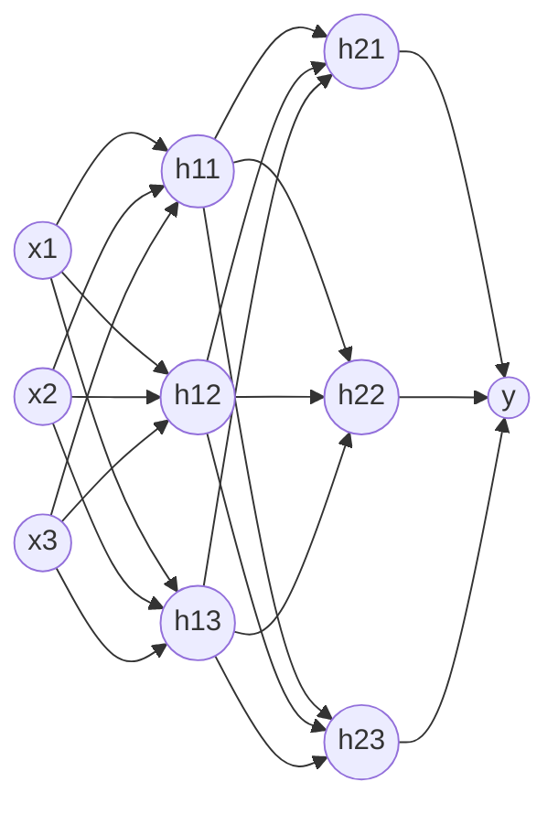

# 全连接神经网络
通过上一章的内容，我们已经了解到多层神经网络的威力，这一章我们就直接上手实操吧。这次我们构造一个有3个输入，2层隐藏层的全连接（每一个神经元都和上一层的所有神经元连接）神经网络，结构如下：

## 5.1 机械组装：全连接网络的代数解构
- 从拓扑图到矩阵乘法：如何把成百上千张“钢板”打包成一个矩阵 $W$？
- 纯 NumPy 编写前向传播（Forward）：几行代码实现空间的批量重塑。

## 5.2 逆向追责：它是怎么知道如何调整钢板的？
- 简述反向传播与梯度更新（为工程实现垫一脚，不用铺太长公式，重在把偏导数类比为“方向调节螺丝”）。

## 5.3 【在线实验】亲眼见证空间的非线性合围
- 提供一个实时可视化的神经网络游乐场。
- **实验一**：两元输入，4个隐藏神经元，成功围剿“异或/甜甜圈”数据。
- **实验二（破坏性测试）**：将隐藏层宽度设为1，亲眼观察脊函数刚性大坝对复杂数据的无能为力。