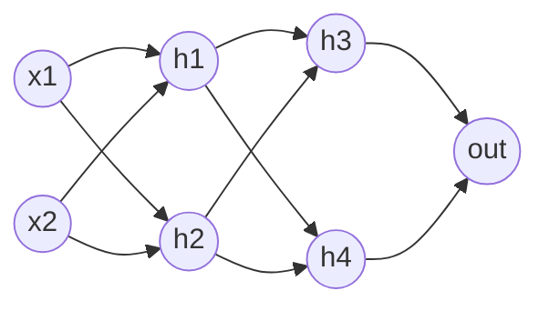
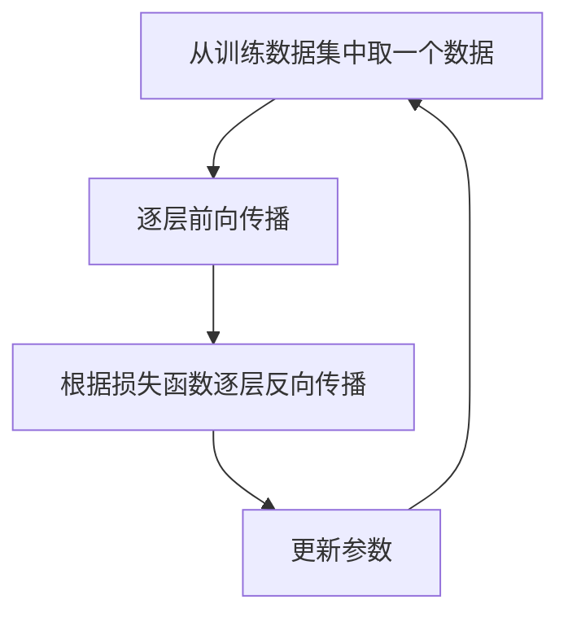
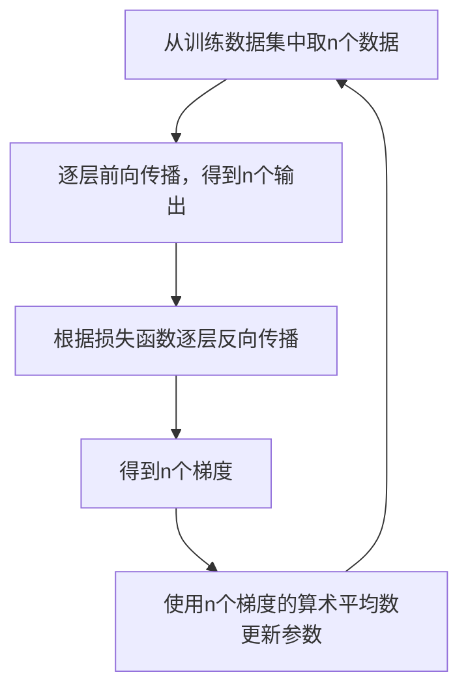

# 多层感知机(MLP)

## 通用可微前馈网络

虽然我们在前一章中构造的DAG计算图很强大，但是如果允许每个节点都拥有不同的内部函数、激活函数，允许节点之间随意连接，那么对于程序编写将会带来灾难性的困难。作为第一步，我们先给计算图做最小程度的规整化，得到一个**通用可微前馈网络（General Differentiable Feedforward Network）**，它只要求：

1. 节点分层，数据只允许向下一层流动（前馈、无环）
2. 每个节点内部的算子对其参数可导（可微，保证反向传播可行）
3. 每个节点拥有自己独立的参数

注意，这里**没有**限制内层算子必须是线性（线性、二次、对数皆可），也**没有**要求“至少一个隐藏层”“相邻层全连接”“同层同激活”——这些更强的约束留到后面“特化成 MLP”时再逐条追加。

对于像下面这个2×2的网络：

$h_1=σ_1(f(x_1,x_2;θ_1))$  
$h_2=σ_1(f(x_1,x_2;θ_2))$

我们可以发现 $h_1$、$h_2$ 的结构除了参数不一样之外，其他地方一模一样。但是这个网络还不够简洁，如果我们再把结构约束加一些，让每个神经元内层算子的定义更加简单，就能得到一个MLP(Multilayer Perceptron)的定义，将会给我们的计算带来质的飞跃。

## 多层感知机-MLP(Multilayer Perceptron)

如果我们把可微前馈网络的要求再进一步增加一些约束条件，就得到了MLP的定义（MLP是可微前馈网络的一个特例）：

1. 至少有一层隐藏层
2. 相邻层之间的节点全连接
3. 同一层的神经元采用同一类非线性激活函数，但各自拥有独立的权重与偏置
4. 每个神经元的内层算子固定为仿射变换：$z=\sum_i \omega_i x_i + b$

那么形如上面2×2的网络中就有：

$h_1=σ(ω_{11}x_1+ω_{12}x_2+b_1)$  
$h_2=σ(ω_{21}x_1+ω_{22}x_2+b_2)$

这下我们就可以使用矩阵来表示上面两个神经元的内部计算步骤：

$$
\begin{bmatrix}
ω_{11} & ω_{12} & b_1 \\
ω_{21} & ω_{22} & b_2
\end{bmatrix}
\times
\begin{bmatrix}
    x_1 \\
    x_2 \\
    1
\end{bmatrix}
=
\begin{bmatrix}
    z_1 \\
    z_2
\end{bmatrix}
$$

其中 $z_1$、$z_2$ 分别是神经元 $h_1$、$h_2$ 内部输出，然后使用激活函数得到：
$$h_1=σ(z_1)$$
$$h_2=σ(z_2)$$

我们依次对每一层执行上述动作，就能得到每一层神经元的输出。

## 跨时代的质变-GPU加速

到这里你得恶补一些计算机图形学的知识了，如果感兴趣可以看看我的另一部知识汇编[3D图形学知识汇编](https://github.com/yangzhenzhuozz/Renderer)，当然还得了解一下OpenGL、Direct3D的知识。

GPU非常擅长处理计算规则重复、而且计算过程独立的计算任务。矩阵乘法中有一部分就是重复的计算 $a_{ik}b_{kj}$，这一步交给GPU再适合不过了。后面每个激活函数在激活 $z$ 的时候，也是量大重复不依赖，也是GPU擅长做的事情。

因为我们的文章是在浏览器上面查看的，所以这里我就用WebGL来做下面的演示了。WebGL 渲染管线里有两个可编程的着色器阶段：

1. Vertex Shader：把顶点从模型空间变换到屏幕空间
2. Fragment Shader：为光栅化出来的每个片元（像素）计算颜色

上述渲染过程也可以把渲染目标改成纹理，这样就不需要把图形真实的渲染到屏幕上了。在上述的工作流程中，每个像素颜色的计算都是独立且并行的一个子程序，如果我们显卡足够强大，并且渲染了一个100\*100像素的目标图像，可以简单的理解为是有一万个线程同时计算。

如果现在需要计算矩阵A\[m\*n\]×矩阵B\[n\*p\]，我们可以按照如下步骤进行：

1. 准备一个\[m\*p\]大小的屏幕作为结果存储器（或者其他可以作为渲染目标的对象）
2. 在Vertex Shader画一个覆盖整个渲染目标的全屏四边形（两个三角形）
3. 在Fragment Shader的像素颜色渲染阶段对每个像素\[ij\]执行
   $$\operatorname{result}[i,j]=\sum\limits_{k=1}^{n}{a_{ik}b_{kj}}$$
4. 读取结果存储器的每个像素颜色作为结果

<GPUMatrix/>

我在写这篇文章的时候，测试结果是GPU会比CPU快10倍左右（使用默认矩阵参数，CPU：i7-13700K，GPU为其自带核显：Intel UHD Graphics 770），这段测试代码最后对比的时候需要将GPU计算结果调整为CPU可读的线性布局，这一步反而是最花时间的，如果我们的矩阵运算都是在GPU中进行，只有在计算完成之后才用CPU读取，可以做的更快。

## 反向传播的矩阵化

可以看到在前向传播的时候,用GPU能加速十倍以上，那么MLP能否在反向传播也使用GPU加速呢？

根据第五章的知识，在MLP反向传播的过程中，我们知道后继一层节点的敏感度之后，神经元自身的敏感度计算公式为（这里的 $i$ 是后继一层的节点下表）：

$$δ =\dfrac{\partial L}{\partial z}=\left(\sum _{i}δ _{i}\dfrac{\partial z_{i}}{\partial h}\right)\dfrac{\partial h}{\partial z}$$

每个神经元内部参数为（这里的 $i$ 本层参数的下表）：

$$\dfrac{\partial L}{\partial ω_i}=δ\dfrac{\partial z}{\partial ω_i}=δx_i$$

我们继续对应本章开头2×2模型，先看看 $h_1$ 敏感度和参数梯度的计算：

$δ_1=(δ_3 ω_{31}+δ_4 ω_{41})\dfrac{\partial h_1}{\partial z_1}$ （$\dfrac{\partial h_1}{\partial z_1}$ 由不同的激活函数决定）

$\dfrac{\partial L}{\partial ω_{11}}=δ_1 x_1$

$\dfrac{\partial L}{\partial ω_{12}}=δ_1 x_2$

$\dfrac{\partial L}{\partial b_1}=δ_1$

接下来再看看 $h_2$ 的敏感度和参数梯度：

$δ_2=(δ_3 ω_{32}+δ_4 ω_{42})\dfrac{\partial h_2}{\partial z_2}$

$\dfrac{\partial L}{\partial ω_{21}}=δ_2 x_1$

$\dfrac{\partial L}{\partial ω_{22}}=δ_2 x_2$

$\dfrac{\partial L}{\partial b_2}=δ_2$

可以看到，如果我们列出这样一个矩阵连乘式子：

$$
\begin{bmatrix}
    ω_{31} & ω_{41} \\
    ω_{32} & ω_{42}
\end{bmatrix}
×
\begin{bmatrix}
    δ_3 \\
    δ_4
\end{bmatrix}
\odot
\begin{bmatrix}
    \dfrac{\partial h_1}{\partial z_1} \\ \dfrac{\partial h_2}{\partial z_2}
\end{bmatrix}
=
\begin{bmatrix}
    δ_1 \\  δ_2
\end{bmatrix}
$$

就可以得到当前层级的敏感度。我们继续用下面的式子计算：

$$
\begin{bmatrix}
    δ_1 \\  δ_2
\end{bmatrix}
\times
\begin{bmatrix}
    x_1 & x_2 & 1
\end{bmatrix}
=
\begin{bmatrix}
    δ_1 x_1 & δ_1 x_2 & δ_1 \\
    δ_2 x_1 & δ_2 x_2 & δ_2
\end{bmatrix}
$$

这个 2×3 矩阵的前两列就是权重梯度 $\dfrac{\partial L}{\partial W}$，第三列就是偏置梯度 $\dfrac{\partial L}{\partial b}$，当前层级各神经元的参数梯度就都算出来了。

## MLP的GPU版

我们在前一章曾经使用计算图来训练一个模型识别是在圆的内部还是外部，而且我还特意把示例的计算图设计的和MLP结构一样，但是当模型宽度为8、深度为3的时候，800个样本训练300轮需要7~8秒钟（虽然sigmoid在深度增加的时候效果并不好，但是我们主要是教学演示），如果我们把这个结构调整为GPU加速版本，就能看到质的飞跃，这是第五章计算图的GPU版本：

<GPUMlp/>

当你实际运行上面的示例后，你可能会大失所望，速度反而远慢于用 JS 写的计算图（当前实现下慢几十倍）。因为这份代码是按照CPU版本的原理，按照下面这个流程训练的：

因为代码中虽然使用GPU来计算矩阵，每次前向传播和反向传播的时候，需要大量的给GPU发送绘制指令，但是每次绘制只让GPU计算一个很小的矩阵。而CPU向GPU发送绘制指令的时候（对应代码里面就是`gl.drawArrays`）需要经过驱动转换等一系列动作，造成GPU计算没花多少时间，反而全在等CPU发送draw指令。所以有一种优化的方法就是一次给前向传播n条数据，这时候就能得到n个输出，然后用这n个输出反向传播，每个参数得到 n 个梯度（每个样本产生一个），模型更新参数的时候就使用这个n个梯度的算术平均数作为结果梯度。

假设现在我们有2组数据，可以构造这样一个矩阵相乘：

$$
\begin{bmatrix}
ω_{11} & ω_{12} & b_1 \\
ω_{21} & ω_{22} & b_2
\end{bmatrix}
\times
\begin{bmatrix}
    x_{11} & x_{12}\\
    x_{21} & x_{22}\\
    1 & 1
\end{bmatrix}
=
\begin{bmatrix}
    z_{11} & z_{12} \\
    z_{21} & z_{22}
\end{bmatrix}
$$

这里的 $x_{12}$ 表示 $x_1$ 的第二组输入， $z_{12}$ 表示 $z_1$ 的第二组输出，可见前向传播可以组装一个更大矩阵进行批量处理。反向传播同样也可以组装一个更大的矩阵来计算，我们可以这样拼：

$$
\begin{bmatrix}
    ω_{31} & ω_{41} \\
    ω_{32} & ω_{42}
\end{bmatrix}
×
\begin{bmatrix}
    δ_{31} & δ_{32} \\
    δ_{41} & δ_{42}
\end{bmatrix}
\odot
\begin{bmatrix}
    \dfrac{\partial h_{11}}{\partial z_{11}} & \dfrac{\partial h_{12}}{\partial z_{12}} \\
    \dfrac{\partial h_{21}}{\partial z_{21}} & \dfrac{\partial h_{22}}{\partial z_{22}}
\end{bmatrix}
=
\begin{bmatrix}
δ_{11} & δ_{12} \\
δ_{21} & δ_{22}
\end{bmatrix}
$$

$δ_{31}$ 表示 $h_3$ 第一组数据的敏感度，$\dfrac{\partial h_{21}}{\partial z_{21}}$ 表示第一组数据中 $h_2$ 神经元内部输出的偏导数，$δ_{21}$ 表示 $h_2$ 神经元在第一组数据的敏感度，这样就可以得 $h_1$、$h_2$ 到各组数据下的敏感度。

$$
\begin{bmatrix}
    δ_{11} & δ_{12}\\
    δ_{21} & δ_{22}
\end{bmatrix}
\times
\begin{bmatrix}
    x_{11} & x_{21} & 1\\
    x_{12} & x_{22} & 1
\end{bmatrix}
=
\begin{bmatrix}
δ_{11}x_{11}+δ_{12}x_{12} & δ_{11}x_{21}+δ_{12}x_{22} & δ_{11}+δ_{12} \\
δ_{21}x_{11}+δ_{22}x_{12} & δ_{21}x_{21}+δ_{22}x_{22} & δ_{21}+δ_{22}
\end{bmatrix}
$$

结果矩阵的每个元素就已经是各组数据的梯度之和了，我们只需要除以数据批次大小就能得到参数的更新量。

## 批量训练的GPU加速

通过上面的知识，我们知道如果利用批量数据训练，就能真正发挥GPU的并行计算能力。
<GPUMlpBatch/>
通过GPU+批次的模式，我们甚至把宽度×深度为80×2的模型耗时189毫秒就训练完了，用CPU训练需要消耗283.73秒，速度提升了一千多倍。如果你仔细观察结果，也许会发现有时候我们GPU版本的训练结果和CPU版本有差异，主要差异来自下面：

1. 每次我们初始化模型时，是使用随机初始化参数和随机的训练数据，这对模型的收敛也有较大影响；
2. CPU版本是使用js的number类型训练的，是64位双精度浮点型，而GPU版本我们使用的是32位浮点型，CPU版可能在计算梯度和更新参数时候稍微占一点点优势，但是在我们这个模型中差异不应该这么大；
3. 两者训练算法不同：GPU版本使用批量训练，批量训练具有梯度更稳定的特点，训练时会比逐个数据更新参数更稳定（数据质量高，且分布均匀的情况下）；
4. GPU版本为了演示训练速度，默认的深度为3（CPU版本为2），而sigmoid函数在深度较深时，容易梯度消失。

如果我们把宽度调整为80甚至800，把深度调整为1，这时候就能看到什么叫做又好又快了。
