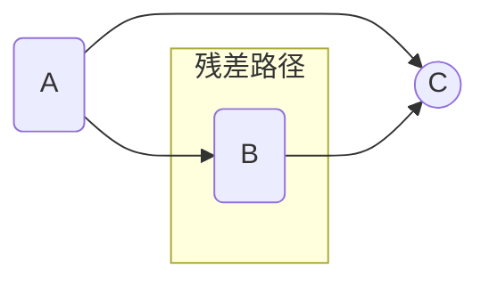
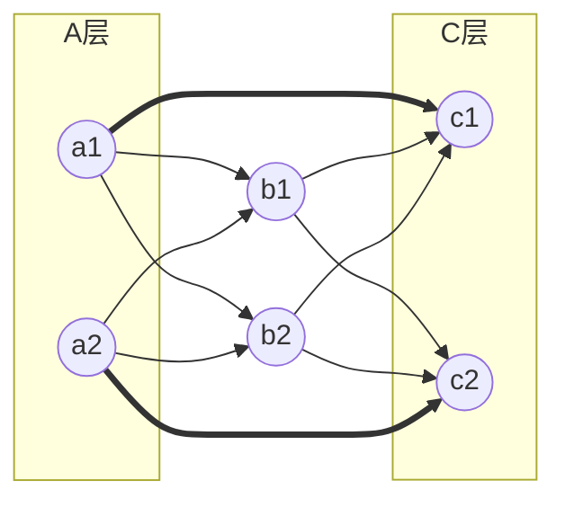

# 残差网络

## MLP深度增加带来的问题

在MLP中，当层数不断增加时，我们之前经常提到的两种激活函数会各自遇到麻烦

| 激活函数 | 深度增加带来的问题           | 随着深度增加的趋势 | 前向传播                                               | 反向传播                    |
| -------- | ---------------------------- | ------------------ | ------------------------------------------------------ | --------------------------- |
| Sigmoid  | 输出进入饱和区 $σ'(z) \to 0$ | 必定发生           | 不管输入怎么变化，输出值趋近一个固定常数，失去表达能力 | 导数趋近0，参数几乎无法更新 |
| ReLU     | 当仿射输出 $z \le 0$ 时      | 概率增加           | 不管输入怎么变化，都输出0                              | 导数为0，参数无法更新       |

Sigmoid 这种情况称为**梯度消失**，ReLU 这种情况则称为**ReLU 死亡（dead ReLU）**

## 残差连接(Skip Connection)

在普通的MLP中，在层级连接 $A \to B \to C$ 中，梯度要从C传回A，必须穿过B。一旦B导致传播链路断了（梯度趋于0），A就收不到任何信号。所以有一种如下图所示的新网络连接方式：

设A层的输出是 $a$，B层的输出是 $b$，C层对输入的处理函数为 $f$，则C层的输出就是：$f(b)+a$。被A层直接绕过的、从 B 一路到 C 输出前的那条路，叫做**残差路径**，残差路径可以是一层也可以是多层。

假设我们有一个这样的残差网络：

$c_1$ 的输出为：$c_1=σ(ω_{c11}b_1+ω_{c12}b_2+\text{bias}_{c1})+a_1$，捷径横跨 A、C 两层（中间隔一层 B），这种叫做跨度为2的残差网络，在这种连接中有两个处理技巧：

1. 如果我们依次往后网络的层数不往后跳了，比如现在有4层网络，我们从C层往后跳的时候不够2层了，可以把最后一跳的跨度调整为1，即剩余网络层数没有跨度这么大了，我们就选择性的跳 $\min(\text{跨度},\text{剩余层数})$。假设后面只有一个D层，则 $d_1$ 的输出为 $d1=σ(ω_{d1}c_1+ω_{d2}c_2+\text{bias}_d)+c_1$
2. 宽度处理：
    1. 如果当前层级和跳跃的目标宽度一致（神经元数量一致），则直接采用一一对应的叠加方式，对应上面的架构图就是$c_1$ 叠加 $a_1$ 的输出，$c_2$ 叠加 $a_2$ 的输出。
    2. 如果宽度不一致，本质上都是在捷径上加一个矩阵 $W_s$，把 A 的输出对齐到 C 的宽度，也就是把 C 的输出从 $f(b)+a$ 变成 $f(b)+W_s a$。补0、丢弃、投影三者的区别只在于 $W_s$ 怎么取：
        1. 补0（A比C少）：把A的输出在缺的位置补0再相加，相当于 $W_s$ 取一个固定的“补0”矩阵。代价是 C 层多出来的那几个神经元在捷径上拿到的永远是0，无法利用残差连接的梯度。
        2. 丢弃（A比C多）：把A多出来的输出直接丢掉，相当于 $W_s$ 取一个固定的“只保留一部分”矩阵。代价是丢哪几个得人为规定（不可学习），且被丢的A神经元从此失去捷径这条梯度通道。
        3. 投影（通用）：$W_s$ 取一个可学习的矩阵，这正是 ResNet 里使用的 $1\times1$ 卷积（在 MLP 中就是一次线性变换）。假设A层宽度为m，C层宽度为n，则先构造一个 $[1 \times m]$ 矩阵存放A层的输出，再构造一个 $[m \times n]$ 的矩阵 $W_s$，两者相乘得到一个 $[1 \times n]$ 矩阵，宽度就对齐到了C，再按宽度一致的方式叠加。

我们先看看等宽残差的神经元公式：

1. 前向传播：$c_1=σ(ω_{c11}b_1+ω_{c12}b_2+\text{bias}_{c1})+a_1$，和之前的唯一差异就是直接加了一个skip层的输出。
2. 反向传播：我们用 $a_1$ 举例，因为 $a_1$ 比MLP多连接了一个神经元，所以在MLP的基础上有轻微的差异：  
   根据计算图的内容，只要神经元还是 $σ(z)$ 的形式，则对当前神经元中某个参数 $\dfrac{\partial L}{\partial ω}=δ\dfrac{\partial z}{\partial ω}$，但是敏感度 $δ=\dfrac{\partial L}{\partial z}$ 不再是简单的用下级节点敏感度累加了，以 $a_1$ 作为举例，设 $a_1$ 连接了 $b$ 层的所有节点，并且用残差连接了 $c_1$，设最终损失函数为 $\text{Loss}=L(b_1,b_2,c_1)$，并且 $c_1=c_1(b_1,b_2,a_1)$，所以我们在计算偏导数的时候千万小心，这是[复合函数的某些中间变量本身又是复合函数的自变量](../01-Math/AdvancedMathematics.md#复合函数的某些中间变量本身又是复合函数的自变量)这种情形。
   $$δ=\dfrac{\partial L}{\partial z_{a_1}}=\dfrac{\partial L}{\partial a_1}\dfrac{\partial a_1}{\partial z_{a_1}}= \underbrace{\dfrac{\partial L}{\partial b_1}\dfrac{\partial b_1}{\partial a_1}\dfrac{\partial a_1}{\partial z_{a_1}}+\dfrac{\partial L}{\partial b_2}\dfrac{\partial b_2}{\partial a_1}\dfrac{\partial a_1}{\partial z_{a_1}}}_{\left(\sum _{i}\delta _{i}\dfrac{\partial z_{i}}{\partial h}\right)\dfrac{\partial h}{\partial z}}+\dfrac{\partial L}{\partial c_1}\dfrac{\partial c_1}{\partial a_1}\dfrac{\partial a_1}{\partial z_{a_1}}$$
   并且有$\dfrac{\partial c_1}{\partial a_1}=1$，在反向传播中，这个1将会让梯度能继续传播。

在构建残差网络的时候，我们也可以构造一个不等宽的连接，通过矩阵变换维度让连接和跳跃的目标层级维度一致。假设a层有2个神经元，c层有3个神经元，则 $W_s$ 矩阵为 $[2 \times 3]$ 的矩阵。它们的前向传播和反向传播计算公式为：

1. 前向传播：
    1. 先用矩阵
        $$
        \begin{bmatrix} a_1 & a_2 \end{bmatrix}
        \times
        \text{W矩阵}\begin{bmatrix}
        w_{11} & w_{12} & w_{13} \\
        w_{21} & w_{22} & w_{23}
        \end{bmatrix}
        =
        \text{S矩阵}\begin{bmatrix}
            a_1 w_{11}+a_2 w_{21} &
            a_1 w_{12}+a_2 w_{22} &
            a_1 w_{13}+a_2 w_{23}
        \end{bmatrix}
        $$
    2. $c_1=σ(ω_{c11}b_1+ω_{c12}b_2+\text{bias}_{c1})+a_1 w_{11}+a_2 w_{21}$

2. 通过前向传播，可以发现 $W_s$ 矩阵是负责给a层神经元加一些系数之后再叠加起来，所以这个矩阵也是可以训练的：
    1. $\dfrac{\partial L}{\partial w_{11}}=\dfrac{\partial L}{\partial c_1}\dfrac{\partial c_1}{\partial w_{11}}$，并且有 $\dfrac{\partial c_1}{\partial w_{11}}=a_1$
    2. 神经元 $a_1$ 的敏感度：因为 $a_1$ 通过矩阵变化，相当于连接到c层的所有结点，所以在计算的时候，我们还得考虑c层其他节点的影响，敏感度计算公式为：
       $$δ=\dfrac{\partial L}{\partial z_{a_1}}=\dfrac{\partial L}{\partial a_1}\dfrac{\partial a_1}{\partial z_{a_1}}= \underbrace{\dfrac{\partial L}{\partial b_1}\dfrac{\partial b_1}{\partial a_1}\dfrac{\partial a_1}{\partial z_{a_1}}+\dfrac{\partial L}{\partial b_2}\dfrac{\partial b_2}{\partial a_1}\dfrac{\partial a_1}{\partial z_{a_1}}}_{\left(\sum _{i}\delta _{i}\dfrac{\partial z_{i}}{\partial h}\right)\dfrac{\partial h}{\partial z}}+\dfrac{\partial L}{\partial c_1}\dfrac{\partial c_1}{\partial a_1}\dfrac{\partial a_1}{\partial z_{a_1}}+\dfrac{\partial L}{\partial c_2}\dfrac{\partial c_2}{\partial a_1}\dfrac{\partial a_1}{\partial z_{a_1}}+\dfrac{\partial L}{\partial c_3}\dfrac{\partial c_3}{\partial a_1}\dfrac{\partial a_1}{\partial z_{a_1}}$$
       其中 $\dfrac{\partial c_1}{\partial a_1}=w_{11}$、$\dfrac{\partial c_2}{\partial a_1}=w_{12}$、$\dfrac{\partial c_3}{\partial a_1}=w_{13}$：不等宽场景下，捷径边的导数不再是等宽时的恒等 $1$，而是 $W_s$ 的对应系数。

非等宽（投影）连接本质上是一个更复杂的计算图：它多了一组可训练参数 $W_s$，捷径边的导数也从恒等 $1$ 变成了 $W_s$ 的系数。但投影捷径仍然是一条直达浅层的路，依然能缓解深度带来的梯度消失，只是信号不如恒等捷径纯净。因此在设计网络时，应尽量减少非等宽的残差连接，仅在维度不匹配、必须对齐时才少量使用。等宽连接理论上也可以用矩阵对齐，但实践中大家都直接让捷径保持恒等（系数为 $1$），以保留最干净的梯度通道。

## 残差网络高效的假说

有一个广被引用的直觉（Veit et al. 2016 的“展开图”视角）：假设有 $A \to B \to C$ 的 3 层网络（skip=2），残差网络同时提供了两条从输入到输出的路径：

1. $A \to B \to C$
2. $A \to C$

随着层数增加，路径数会**指数级**增长（例如 $n$ 个“跨一层”的残差块就有 $2^n$ 条路径），于是网络不再是“一条很深的链”，而更像“许多条深浅不一的子网络在同时工作”。

但要注意，这只是一个**假说**，并非业界的最终结论。最重要的保留意见是：这些路径**共享同一套参数**——每条“子网络”都是同一张大网的子图，彼此高度相关，并不是一群独立训练的网络。

## 示例

在下面的demo中可以看到，通过残差连接，即使是sigmoid这种激活函数，在5层深度下都还能有不错的训练效果
<GPUSkipBatch/>
