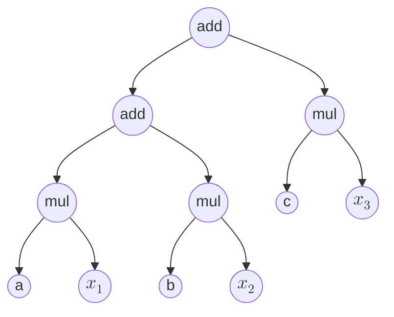
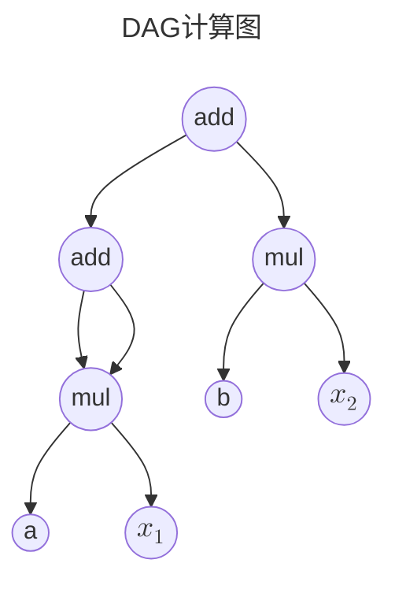
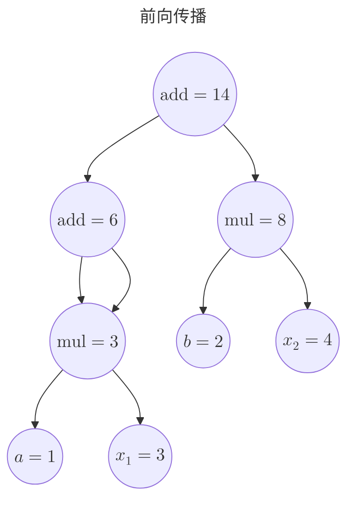
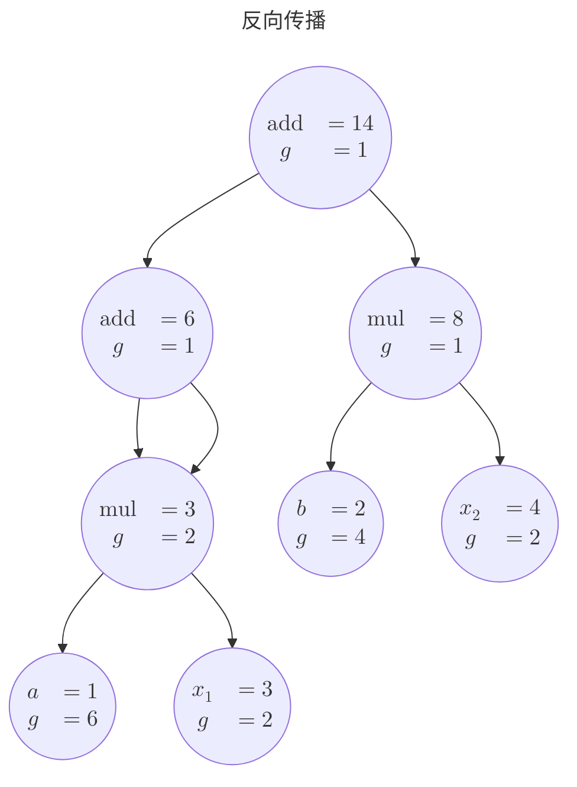

# PyTorch的奥秘

前面两章，我们写了 GPU 版的 MLP 和残差网络，虽然我自己已经把涉及的数学公式全部整理了一遍，但是整个过程极其不顺利，整个过程用一个词形容再合适不过：如履薄冰。

除了繁琐的WebGL初始化流程，写代码的时候，数据被塞进 GPU 纹理、计算被写进 fragment shader，神经网络的前向与反向传播，被拆成一个个 `gl.drawArrays`。调参数的时候，没法像普通程序那样 `print` 中间值，也不方便下断点，只能去先让GPU渲染一帧画面，然后读取画面中某个像素的颜色值看看对不对。我的“古法编程”在这里失灵了，只能让AI帮我审查shader是哪里出了问题。最后我彻底放弃自己手写代码，全部让AI帮我编写。

为什么会这样？因为 WebGL 本来就不是为深度学习准备的：它眼里只有着色器、纹理和像素这三样东西。我们在前面的 GPU 相关章节已经踩过一遍，而关于它们的完整来龙去脉，我另写了一篇《3D图形学知识汇编》（[Renderer](https://github.com/yangzhenzhuozz/Renderer)），这里不再展开。本章只需要记住它带给我们的诸多不便：

1. 算子在 fragment shader 里跑，出错了只能靠“看看颜色”去猜；
2. 数据存在 GPU 纹理里，想看中间值只有 `readPixels` 一条路；
3. 前向、反向、权重更新，每一层都要自己手写矩阵和梯度；
4. 每个节点的导数需要自己小心设置。

如果这些都能交给一个现成的框架——张量运算替你写矩阵，自动求导替你推反向，优化器替你更新参数，还允许你随时把数据拿回 CPU 用 `print` 和断点调试——那我们就能把精力放回模型本身。这个想法，正是本章的主角：**PyTorch**。它就像一把机器学习领域的瑞士军刀，把那些零散又费劲的活，全收进了一个工具箱。

但是这里我并不准备教大家怎么使用PyTorch，因为网上的教程已经足够多了，在网上随便一搜索就有一大堆教程。所以我准备来点有挑战性的，把PyTorch的核心拆开。

## 填平通用计算图的坑

我们在第5章介绍了通用计算图，并且在第6章中说了MLP的优势--简洁。在通用计算图中，节点函数各式各样、边可以随意连，最要命的是——反向传播的导数必须我们自己推、自己接线：整条复合链一展开就是个巨无霸式子，每个节点的偏导都得小心翼翼设好。而高数里的链式法则给了我们一条出路：

设 $z=f(x,y)$ ，且 $x=x(s,t)$，$y=y(s,t)$，那么就一定有
$$\frac{\partial z}{\partial s}=\frac{\partial z}{\partial x}\frac{\partial x}{\partial s}+\frac{\partial z}{\partial y}\frac{\partial y}{\partial s}$$

如果我们前向传播的时候，不再是一股脑的把多层复合给合并成一个函数，那么我们就能一层一层自动的推导出整个复合函数的导数，这可比不定积分好算多了（初等函数求导后仍是初等函数，但积分未必）。

如果我们要求使用者不能自己写函数，只能用一元或二元的初等算子，把任意多输入的复合函数搭成一棵图，这样就拥有了自动推导导数的工具了。比如对于 $out=ax_1+bx_2+cx_3$ 这样一个函数，我们可以构造这样一棵树（学过编译原理的人有福了，这就是一棵抽象语法树）：

因为每个初等函数的导数都是已知的，通过这棵树，我们可以很轻松的从上往下推导每个节点的导数。甚至于对于某些节点复用，只要计算过程中没有环，即我们构造的是一个DAG，这份推导方式也适用，比如：$out=ax_1+ax_1+bx_2$，我们可以构造这样一个DAG

这里假设add算子接受两个参数 $add(x,y)$，用高数里多元复合函数偏导数的思想，就算实际情况中y是x的函数，我们也可以用换元法，把x,y理解成两个独立变量，具体数学原理见[复合函数的某些中间变量本身又是复合函数的自变量](../01-Math/AdvancedMathematics.md#复合函数的某些中间变量本身又是复合函数的自变量)。

反向传播总得有个起点：最高处的那个节点先拿到一个初始梯度 $1$，因为 $\frac{\partial \operatorname{out}}{\partial \operatorname{out}}=1$，当然如果 $\operatorname{out}=\operatorname{Loss}$ 函数，就刚好能用到机器学习里面。从它开始，每个算子 $O$ 都会收到一个**从输出侧传来的梯度** $g=\dfrac{\partial \operatorname{out}}{\partial O}$，然后把它分配到自己的两个输入（$v_1,v_2$）：

| 算子节点 | $\frac{\partial O}{\partial v_1}$ | $\frac{\partial O}{\partial v_2}$ | 传给输入的梯度    |
| -------- | --------------------------------- | --------------------------------- | ----------------- |
| add      | 1                                 | 1                                 | $(g,\ g)$         |
| mul      | $v_2$                             | $v_1$                             | $(g v_2,\ g v_1)$ |

mul 的局部导数用的是 $v_1$、$v_2$ 在前向时的取值，同时还需要特别**注意**：当一个节点被使用多次的时候，如图中的一个 $\text{mul}$ 节点，我们需要把每次传播的梯度值累加，从数学上很容易理解，设 $y=f(x,x)$，我们可以把两个 $x$ 分别换元成 $x_1$、$x_2$，则有：
$$\begin{aligned}
  y & =f(x_1,x_2) \\
  dy & =\dfrac{\partial f}{\partial x_1}dx_1+\dfrac{\partial f}{\partial x_2}dx_2  
\end{aligned}$$

最后再令 $x_1=x_2=x$，此时 $\dfrac{dx_1}{dx}=\dfrac{dx_2}{dx}=1$，于是
$$\frac{dy}{dx}=\frac{\partial f}{\partial x_1}+\frac{\partial f}{\partial x_2}$$

这就是"一个节点被用几次，梯度就加几次"的数学来源。

现在我们给计算图的 $(a,b,x_1,x_2)$ 设置一个初始值 $(1,2,3,4)$，通过前向传播，我们得到这样一个状态的计算图

接下来我们反向传播一下：

然后我们手动验算一下：

$$y = ax_1+ax_1+bx_2 \quad \Rightarrow\quad \frac{\partial y}{\partial a}=2x_1=6,\quad \frac{\partial y}{\partial x_1}=2a=2$$

相比第 5 章，我们只做了一个微调，禁止用户自己写边的连接函数，必须使用我们设定的初等函数算子，接下来就直接起飞，再也不用小心翼翼的设置每个节点计算函数和导数了。
