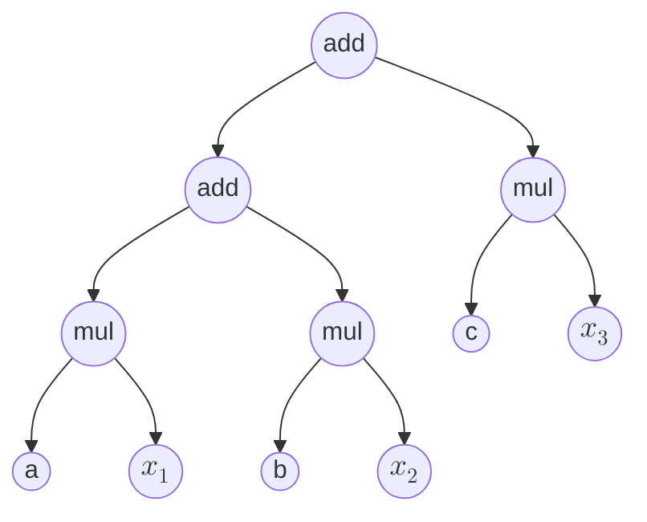
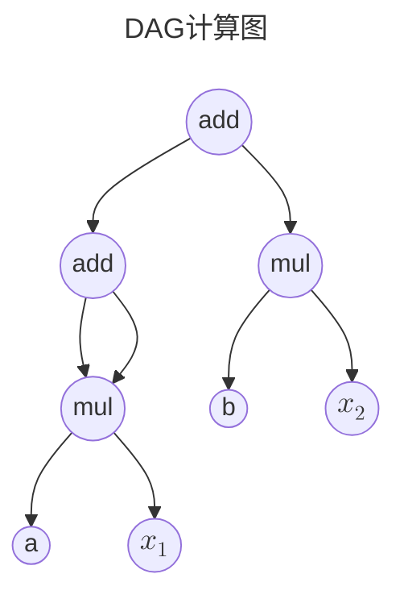
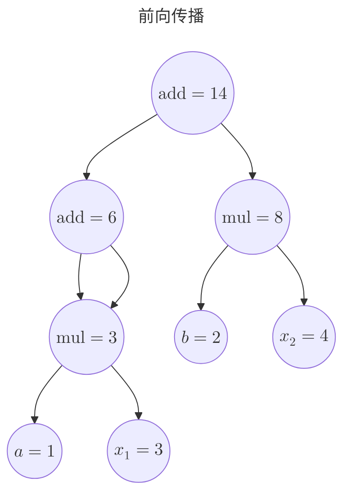
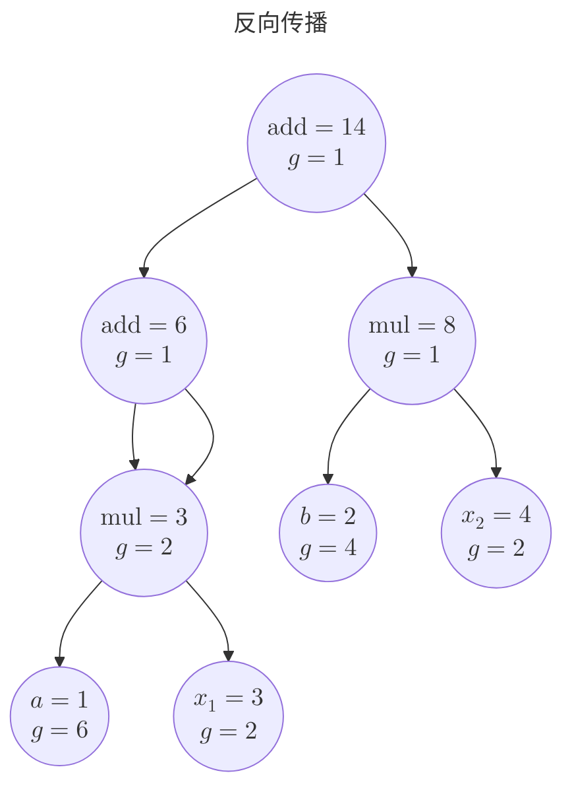
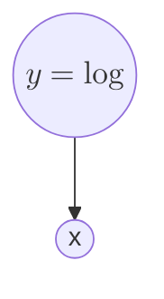
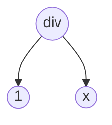

# PyTorch的奥秘

前面两章，我们写了 GPU 版的 MLP 和残差网络，虽然我自己已经把涉及的数学公式全部整理了一遍，但是整个过程极其不顺利，整个过程用一个词形容再合适不过：如履薄冰。

除了繁琐的WebGL初始化流程，写代码的时候，数据被塞进 GPU 纹理、计算被写进 fragment shader，神经网络的前向与反向传播，被拆成一个个 `gl.drawArrays`。调参数的时候，没法像普通程序那样 `print` 中间值，也不方便下断点，只能去先让GPU渲染一帧画面，然后读取画面中某个像素的颜色值看看对不对。我的“古法编程”在这里失灵了，只能让AI帮我审查shader是哪里出了问题。最后我彻底放弃自己手写代码，全部让AI帮我编写。

为什么会这样？因为 WebGL 本来就不是为深度学习准备的：它眼里只有着色器、纹理和像素这三样东西。我们在前面的 GPU 相关章节已经踩过一遍，而关于它们的完整来龙去脉，我另写了一篇《3D图形学知识汇编》（[Renderer](https://github.com/yangzhenzhuozz/Renderer)），这里不再展开。本章只需要记住它带给我们的诸多不便：

1. 算子在 fragment shader 里跑，出错了只能靠“看看颜色”去猜；
2. 数据存在 GPU 纹理里，想看中间值只有 `readPixels` 一条路；
3. 前向、反向、权重更新，每一层都要自己手写矩阵和梯度；
4. 每个节点的导数需要自己小心设置。

如果这些都能交给一个现成的框架——张量运算替你写矩阵，自动求导替你推反向，优化器替你更新参数，还允许你随时把数据拿回 CPU 用 `print` 和断点调试——那我们就能把精力放回模型本身。这个想法，正是本章的主角：**PyTorch**。它就像一把机器学习领域的瑞士军刀，把那些零散又费劲的活，全收进了一个工具箱。

但是这里我并不准备教大家怎么使用PyTorch，因为网上的教程已经足够多了，在网上随便一搜索就有一大堆教程。所以我准备来点有挑战性的，把PyTorch的核心拆开。

## 填平通用计算图的坑

我们在第5章介绍了通用计算图，并且在第6章中说了MLP的优势--简洁。在通用计算图中，节点函数各式各样、边可以随意连，最要命的是——反向传播的导数必须我们自己推、自己接线：整条复合链一展开就是个巨无霸式子，每个节点的偏导都得小心翼翼设好。而高数里的链式法则给了我们一条出路：

设 $z=f(x,y)$ ，且 $x=x(s,t)$，$y=y(s,t)$，那么就一定有
$$\frac{\partial z}{\partial s}=\frac{\partial z}{\partial x}\frac{\partial x}{\partial s}+\frac{\partial z}{\partial y}\frac{\partial y}{\partial s}$$

如果我们前向传播的时候，不再是一股脑的把多层复合给合并成一个函数，那么我们就能一层一层自动的推导出整个复合函数的导数，这可比不定积分好算多了（初等函数求导后仍是初等函数，但积分未必）。

如果我们要求使用者不能自己写函数，只能用一元或二元的初等算子，把任意多输入的复合函数搭成一棵图，这样就拥有了自动推导导数的工具了。比如对于 $out=ax_1+bx_2+cx_3$ 这样一个函数，我们可以构造这样一棵树（学过编译原理的人有福了，这就是一棵抽象语法树）：



因为每个初等函数的导数都是已知的，通过这棵树，我们可以很轻松的从上往下推导每个节点的导数。甚至于对于某些节点复用，只要计算过程中没有环，即我们构造的是一个DAG，这份推导方式也适用，比如：$out=ax_1+ax_1+bx_2$，我们可以构造这样一个DAG



这里假设add算子接受两个参数 $add(x,y)$，用高数里多元复合函数偏导数的思想，就算实际情况中y是x的函数，我们也可以用换元法，把x,y理解成两个独立变量，具体数学原理见[复合函数的某些中间变量本身又是复合函数的自变量](../01-Math/AdvancedMathematics.md#复合函数的某些中间变量本身又是复合函数的自变量)。

反向传播总得有个起点：最高处的那个节点先拿到一个初始梯度 $1$，因为 $\frac{\partial \operatorname{out}}{\partial \operatorname{out}}=1$，当然如果 $\operatorname{out}=\operatorname{Loss}$ 函数，就刚好能用到机器学习里面。从它开始，每个算子 $O$ 都会收到一个**从输出侧传来的梯度** $g=\dfrac{\partial \operatorname{out}}{\partial O}$，然后把它分配到自己的两个输入（$v_1,v_2$）：

| 算子节点 | $\frac{\partial O}{\partial v_1}$ | $\frac{\partial O}{\partial v_2}$ | 传给输入的梯度    |
| -------- | --------------------------------- | --------------------------------- | ----------------- |
| add      | 1                                 | 1                                 | $(g,\ g)$         |
| mul      | $v_2$                             | $v_1$                             | $(g v_2,\ g v_1)$ |

mul 的局部导数用的是 $v_1$、$v_2$ 在前向时的取值，同时还需要特别**注意**：当一个节点被使用多次的时候，如图中的一个 $\text{mul}$ 节点，我们需要把每次传播的梯度值累加，从数学上很容易理解，设 $y=f(x,x)$，我们可以把两个 $x$ 分别换元成 $x_1$、$x_2$，则有：

$$
\begin{aligned}
  y & =f(x_1,x_2) \\
  dy & =\dfrac{\partial f}{\partial x_1}dx_1+\dfrac{\partial f}{\partial x_2}dx_2
\end{aligned}
$$

最后再令 $x_1=x_2=x$，此时 $\dfrac{dx_1}{dx}=\dfrac{dx_2}{dx}=1$，于是
$$\frac{dy}{dx}=\frac{\partial f}{\partial x_1}+\frac{\partial f}{\partial x_2}$$

这就是"一个节点被用几次，梯度就加几次"的数学来源。

现在我们给计算图的 $(a,b,x_1,x_2)$ 设置一个初始值 $(1,2,3,4)$，通过前向传播，我们得到这样一个状态的计算图



接下来我们反向传播一下：



然后我们手动验算一下：

$$y = ax_1+ax_1+bx_2 \quad \Rightarrow\quad \frac{\partial y}{\partial a}=2x_1=6,\quad \frac{\partial y}{\partial x_1}=2a=2$$

相比第 5 章，我们只做了一个微调，禁止用户自己写边的连接函数，必须使用我们设定的初等函数算子，接下来就直接起飞，再也不用小心翼翼的设置每个节点计算函数和导数了。在实际工程的实践中，是允许用户自定义算子的，但是需要对每个定义的算子设置好导数公式。

## 计算图的进阶：矩阵算子

前面我们定义的都是标量算子，但是在机器学习中，我们经常会需要对向量、矩阵进行计算，向量计算可以抽象成一维矩阵。所以我们还需要针对矩阵定义以下三类算子：

1. 逐元素算子：依次对矩阵中的每一个元素进行初等函数运算
2. 矩阵乘法算子：进行矩阵乘法
3. 形状/归约算子：对矩阵进行变形，比如转置、累加等

### 逐元素算子

顾名思义，就是对矩阵中的每一个元素进行计算，比如

数乘：

$$2 \times \begin{bmatrix}1 & 2\\3 & 4\end{bmatrix}=\begin{bmatrix}2 & 4\\6 & 8\end{bmatrix}$$

逐元素相乘：

$$
\begin{bmatrix}1&2\\3&4\end{bmatrix}
\odot
\begin{bmatrix}5&6\\7&8\end{bmatrix}
=
\begin{bmatrix}5&12\\21&32\end{bmatrix}
$$

对于矩阵的逐元素算子，处理方法很简单，不管是前向传播还是反向传播，我们都可以当初前面计算图中的标量情况处理，当成有矩阵元素这么多个独立DAG处理即可，因为这些DAG相互独立并且结构一致，可以用并行硬件加速计算。

### 矩阵乘法算子

设有一个矩阵A $[m \times n]$ 和一个矩阵B $[n \times p]$，则两个矩阵相乘的前向传播公式为：

$$
A \times B=
\begin{bmatrix}
a_{11} & a_{12} & \cdots & a_{1n}\\
a_{21} & a_{22} & \cdots & a_{2n}\\
\vdots & \vdots & \ddots & \vdots\\
a_{m1} & a_{m2} & \cdots & a_{mn}
\end{bmatrix}
\times
\begin{bmatrix}
b_{11} & b_{12} & \cdots & b_{1p}\\
b_{21} & b_{22} & \cdots & b_{2p}\\
\vdots & \vdots & \ddots & \vdots\\
b_{n1} & b_{n2} & \cdots & b_{np}
\end{bmatrix}
=
\begin{bmatrix}
\sum_{k=1}^{n}a_{1k}b_{k1} & \sum_{k=1}^{n}a_{1k}b_{k2} & \cdots & \sum_{k=1}^{n}a_{1k}b_{kp}\\
\sum_{k=1}^{n}a_{2k}b_{k1} & \sum_{k=1}^{n}a_{2k}b_{k2} & \cdots & \sum_{k=1}^{n}a_{2k}b_{kp}\\
\vdots & \vdots & \ddots & \vdots\\
\sum_{k=1}^{n}a_{mk}b_{k1} & \sum_{k=1}^{n}a_{mk}b_{k2} & \cdots & \sum_{k=1}^{n}a_{mk}b_{kp}
\end{bmatrix}
=C
$$

看起来似乎很复杂，其实真正涉及的计算就只有加法和乘法，设结果矩阵的梯度矩阵为：

$$
G=\begin{bmatrix}
g_{11} & \cdots & g_{1p} \\
\vdots & \ddots & \vdots \\
g_{m1} & \cdots & g_{mp}
\end{bmatrix}
$$

这样看起来可能太抽象了，我们用一个具体的矩阵示例一下：

$$
\begin{bmatrix}
    a_{11} & a_{12} & a_{13} \\
    a_{21} & a_{22} & a_{23} \\
\end{bmatrix}
\times
\begin{bmatrix}
b_{11} & b_{12} \\
b_{21} & b_{22} \\
b_{31} & b_{32}
\end{bmatrix}
=
\begin{bmatrix}
    a_{11}b_{11}+a_{12}b_{21}+a_{13}b_{31} & a_{11}b_{12}+a_{12}b_{22}+a_{13}b_{32} \\
    a_{21}b_{11}+a_{22}b_{21}+a_{23}b_{31} & a_{21}b_{12}+a_{22}b_{22}+a_{23}b_{32}
\end{bmatrix}
$$

结果矩阵的梯度矩阵为：

$$
\begin{bmatrix}
    \dfrac{\partial \text{out}}{\partial c_{11}} & \dfrac{\partial \text{out}}{\partial c_{12}}\\
    \dfrac{\partial \text{out}}{\partial c_{21}} & \dfrac{\partial \text{out}}{\partial c_{22}}
\end{bmatrix}
=
\begin{bmatrix}
    g_{11} & g_{12} \\
    g_{21} & g_{22}
\end{bmatrix}
$$

我们挑选 $a_{23}$ 和 $b_{31}$ 作为计算例子，则有

$$
\begin{aligned}
\dfrac{\partial \text{out}}{\partial a_{23}}=\dfrac{\partial \text{out}}{\partial c_{21}}\dfrac{{\partial c_{21}}}{\partial a_{23}}+\dfrac{\partial \text{out}}{\partial c_{22}}\dfrac{{\partial c_{22}}}{\partial a_{23}}=g_{21}b_{31}+g_{22}b_{32}
\\
\dfrac{\partial \text{out}}{\partial b_{31}}=\dfrac{\partial \text{out}}{\partial c_{11}}\dfrac{{\partial c_{11}}}{\partial b_{31}}+\dfrac{\partial \text{out}}{\partial c_{21}}\dfrac{{\partial c_{21}}}{\partial b_{31}}=g_{11}a_{13}+g_{21}a_{23}
\end{aligned}
$$

- 对 $A$ 的元素 $a_{ij}$：$\dfrac{\partial\text{out}}{\partial a_{ij}}=\sum\limits_{k=1}^p g_{ik}b_{jk}$（所以 $a_{23}$ 那条对：$g_{21}b_{31}+g_{22}b_{32}$）；
- 对 $B$ 的元素 $b_{ij}$：$\dfrac{\partial\text{out}}{\partial b_{ij}}=\sum\limits_{k=1}^m g_{kj}a_{ki}$（所以 $b_{31}$ 就是 $g_{11}a_{13}+g_{21}a_{23}$）

这里用 $\sum$ 的原因和之前说的一致，假设最终输出为：$\operatorname{out}(c_{11},c_{12},c_{21},c_{22})$，那么结果矩阵中的每个元素就是 $\operatorname{out}$ 函数的元（自变量）。

### 形状/归约算子

对于矩阵变形算子，我们只需要把前向传播的结果矩阵和反向的梯度矩阵都跟着变形就可以了，比如下面这两种：

$$
\begin{bmatrix}
    a_{11} & a_{12} & a_{13} \\
    a_{21} & a_{22} & a_{23}
\end{bmatrix}
\xRightarrow{\text{把二维矩阵变成向量}}
\begin{bmatrix}
    a_{11} & a_{12} & a_{13} & a_{21} & a_{22} & a_{23}
\end{bmatrix}
$$

$$
\begin{bmatrix}
    a_{11} & a_{12} & a_{13} \\
    a_{21} & a_{22} & a_{23}
\end{bmatrix}
\xRightarrow{\text{转置矩阵}}
\begin{bmatrix}
    a_{11} & a_{21} \\
    a_{12} & a_{22} \\
    a_{13} & a_{23}
\end{bmatrix}
$$

而对于规约算子，我们就需要设置算子对每个元素的导数，假设现在有一个针对一维矩阵的 $\operatorname{sum}$ 算子：

$$
\operatorname{sumMat} \big(\begin{bmatrix}a_1 & a_2 & \cdots & a_n\end{bmatrix}\big)=a_1+a_2+\cdots+a_n
$$

设 sumMat 节点的梯度为 g，则反向传播时，将 sumMat 算子参数矩阵的梯度矩阵设置为

$$
\begin{bmatrix}
    \dfrac{\partial \text{out}}{\partial \text{sumMat}} & \dfrac{\partial \text{out}}{\partial \text{sumMat}} & \cdots & \dfrac{\partial \text{out}}{\partial \text{sumMat}}
\end{bmatrix}
=
\begin{bmatrix}
    g & g & \cdots & g
\end{bmatrix}
$$

规约算子需要根据具体函数进行设置，本质上还是一个多元函数的偏导数，比如sum算子是加法操作，加法对每个输入变量的导数恒为 1，所以把上游梯度原样传给每个元素。

### PyTorch的优秀工程实践特性

前面的内容虽然已经把PyTorch的数学原理说了一大堆，但是还有几个工程方面的优秀特性没有介绍：

1. requires_grad 与叶子张量：只有 `requires_grad=True` 的叶子张量才在 `.grad` 上累积梯度

    实际运行起来的计算图往往都非常巨大，如果给每个中间节点都存放梯度，会额外消耗 $O(n)$ 的存储空间

    ```mermaid
    flowchart TD
    a((a))
    b((b))
    c((c))
    add1((add)) --> b & c
    add2((add)) --> add1 & a
    ```

    假设都是2元算子，要把n个叶子汇总成一个树的根节点，需要消耗 $n-1$ 个中间节点，并且有的叶子节点本身也不需要计算梯度。

1. 动态图
   PyTorch的计算图是动态构建的，并不是先把图画好，然后一步步推导。靠着`C++/python`提供的操作符重载能力，我们可以把上面的图写成下面的伪代码：

    ```python
    a = leaf(1.0,requires_grad=True)
    b = leaf(1.0,requires_grad=True)
    c = leaf(1.0,requires_grad=True)

    tmp=b+c
    out=a+tmp
    ```

    PyTorch会根据实际执行的代码，动态的创建出计算图，为autograd提供支持。如果是像`java/js`这种不支持操作符重载的编程语言，只能丑陋的写成

    ```java
    Leaf a = new Leaf(1.0,true);
    Leaf b = new Leaf(1.0,true);
    Leaf c = new Leaf(1.0,true);

    Node tmp = b.add(c);
    Node out = tmp.add(a);
    ```

    动态图允许在执行过程中对任意一个阶段调试，而且这种构建也符合人类直觉。

### 高阶导数

在PyTorch中，求导的过程可以生成一张计算图，然后生成的这个图还能继续求导。比如：

```python
import torch
x = torch.tensor(2.0, requires_grad=True)
y = torch.log(x)
dy_dx = torch.autograd.grad(y,x,create_graph=True)[0]
# 第二次求导
d2y_dx2 = torch.autograd.grad(dy_dx,x)[0]
print("x =", x)
print("y =", y)
print("一阶导 dy/dx =", dy_dx)
print("二阶导 d²y/dx² =", d2y_dx2)
```

PyTorch会按照如下流程创建计算图：



在使用y对x求导的时候，可以根据 $\log$ 算子知道求导公式为 $y'=\dfrac{1}{x}$ （PyTorch等很多数学库都会用自然对数做log函数的底数，因为 $\ln(x)$ 用的多，人们先针对 $e$ 为底的对数函数写了一些优化算法，并且用对数的换底公式 $\dfrac{\log_a n}{\log_a m}=\log_m n$来表达任意的log，所以很多数学库的 $\log$ 实际上是 $\ln$），然后构造出下面这个图，并且把图的信息附带到变量`dy_dx`中：



这时候第二次求导就会用这个图更高阶的导数

### 从任意节点开始反向

在真实的反向传播中，我们不一定需要从最终的 $\text{Loss}$ 开始，只要知道了中间位置的前向传播输出和现有梯度（可以是一个预设值或者通过某种算法算出来的），就可以从中间位置开始反向传播，在训练部分输出、自定义梯度回传、逐层梯度检查，这将是一个强力功能。

这里"现有梯度"有个神奇的地方值得细说：只有当这个中间节点恰好是你要对它自己求导的那个标量（它自己成了根）时，这个预设值才等于 $1$，也就是前面说的 $\frac{\partial \text{out}}{\partial \text{out}}=1$；如果起点是个矩阵，初始梯度就得是一个和它**同形**的矩阵 $G$，具体取什么值要看这个矩阵朝输出方向是如何被汇总成标量的——如果紧挨着的后继节点是 $\operatorname{matSum}$（求和），那么初始梯度就是全 $1$ 矩阵。说了这么多，其实就是看这个中间位置你想对谁求导：标量对自己求导就是 $1$，而矩阵在我们这套规则里不能对自己求导，必须由一个标量来对矩阵求导（换句话说，计算图中只允许"标量对矩阵"这一种梯度，不允许"矩阵对矩阵"的雅可比，否则就和设计不符了；当然，数学上完全可以给矩阵定义求导规则）。

### 后续可选主题

- 优化器与参数更新（SGD、学习率）——可另开一章。
